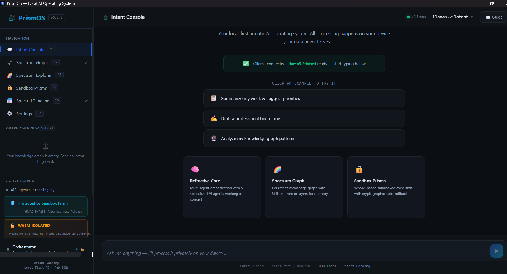
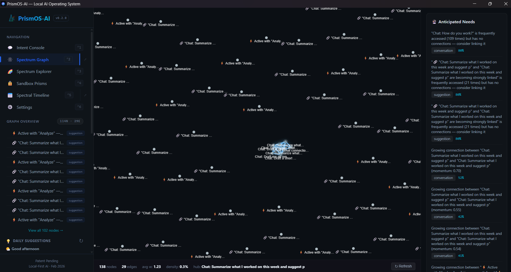
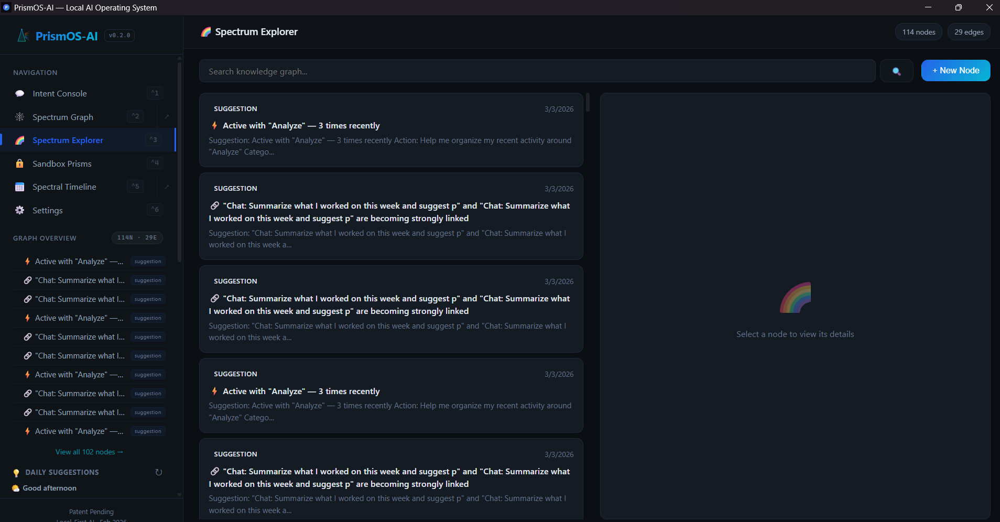
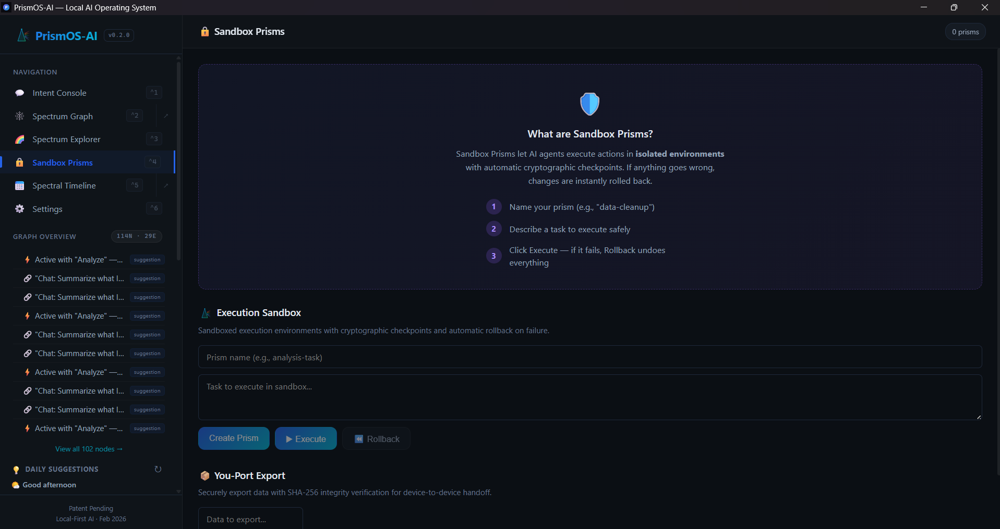
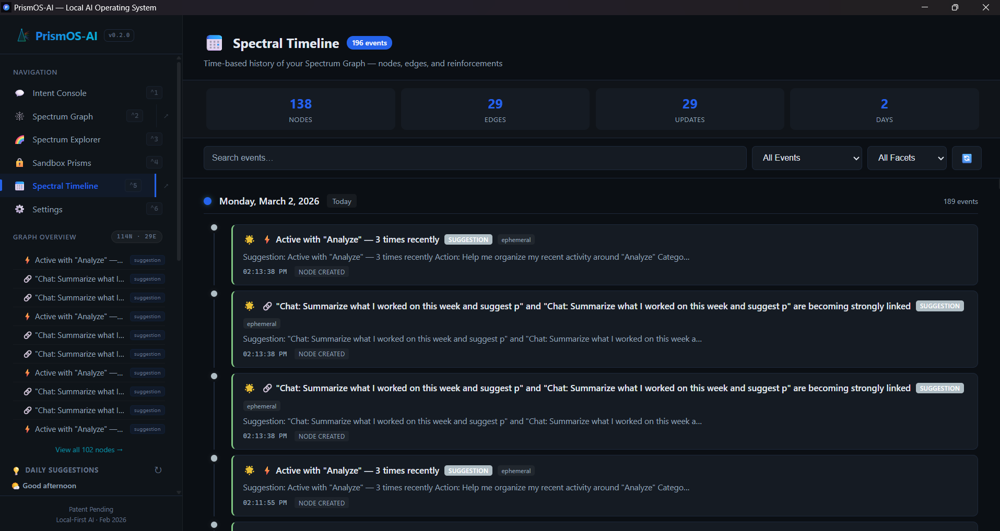
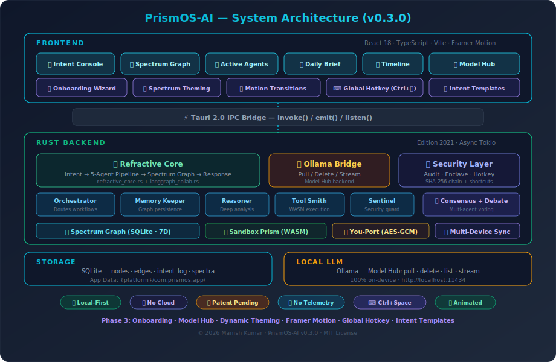

# PrismOS-AI — Local-First Agentic Personal AI Operating System

> **Try it in 30 seconds:** `git clone https://github.com/mkbhardwas12/prismos-ai.git && cd prismos-ai && npm install && npm run tauri dev`

[](https://github.com/mkbhardwas12/prismos-ai/actions/workflows/ci.yml)
[](https://github.com/mkbhardwas12/prismos-ai/releases/latest)
[](https://github.com/mkbhardwas12/prismos-ai)
[](LICENSE)
[-blueviolet)](https://ollama.com)
[](.)
[](https://github.com/mkbhardwas12/prismos-ai/releases/latest)

**Patent Pending** — US Provisional Patent filed February 2026

PrismOS-AI is a **local-first agentic personal AI operating system** built with Tauri 2.0 + React 18 + Rust. It runs **100% on your device** — your data never leaves your machine. Eight collaborative AI agents work together via a formal debate pipeline, storing everything in a persistent 7-dimensional Spectrum Graph that grows with you. Features include **Local Vision**, **Document RAG**, **Background Omnipresence** (Alt+Space), **Proactive Suggestions**, **WASM Sandbox Prisms**, and a modern glassmorphism UI — all running entirely offline.

<p align="center">
  
</p>

<details>
<summary><strong>📸 More Screenshots</strong> (click to expand)</summary>
<br />

| Spectrum Graph | Spectrum Explorer |
|:-:|:-:|
|  |  |

| Sandbox Prisms | Spectral Timeline |
|:-:|:-:|
|  |  |

| Voice Input | Security Audit Log |
|:-:|:-:|
| *Screenshot coming soon — speak your intents via local voice engine* | *Screenshot coming soon — tamper-proof SHA-256 hash chain audit trail* |

</details>

---

## ✨ Core Features (v0.5.1)

| Feature | Description |
|---------|-------------|
| **Refractive Core™** | Intent processing pipeline |
| **Spectrum Graph™** | Persistent multi-dimensional knowledge graph |
| **8 AI Agents** | Orchestrator, Memory Keeper, Reasoner, Tool Smith, Sentinel, Email Keeper, Calendar Keeper, Finance Keeper |
| **LangGraph Debates** | Multi-agent debate with formal consensus voting |
| **Sandbox Prism™** | WASM-isolated execution environment |
| **Daily Dashboard** | Unified morning-brief view with stats, calendar, email, finance cards, quick links *(Phase 7)* |
| **ProactivePanel** | Permanent collapsible sidebar panel with live calendar, email, finance, graph feeds *(Phase 7)* |
| **Proactive Suggestions** | Context-aware cards that auto-process on click |
| **Morning Brief / Evening Recap** | Daily summary of your knowledge graph activity |
| **Email Keeper** | AI agent for email monitoring, summaries, and smart notifications *(Phase 7)* |
| **Calendar Keeper** | AI agent for calendar awareness, scheduling, and reminders *(Phase 7)* |
| **Finance Keeper** | AI agent for portfolio tracking, market alerts, and financial insights *(Phase 7)* |
| **Startup View Setting** | Choose default view on launch (Dashboard, Chat, Graph, etc.) in Settings *(Phase 7)* |
| **You-Port™** | Encrypted state migration |
| **Voice I/O** | Hybrid local voice engine (cpal audio capture + Web Speech API fallback) |
| **Spectral Timeline** | Time-series view of knowledge evolution |
| **Multi-Window** | Open Spectrum Graph in a separate window |
| **Onboarding Wizard** | Multi-step first-run setup experience *(Phase 3)* |
| **Model Hub** | Browse, download & manage Ollama models in-app *(Phase 3)* |
| **Spectrum Theming** | Dynamic themes driven by Spectrum Graph spectral properties *(Phase 3)* |
| **Framer Motion Polish** | Smooth page transitions, card animations, stagger effects *(Phase 3)* |
| **Global Hotkey** | `Ctrl+Space` / `Cmd+Space` to instantly summon the app *(Phase 3)* |
| **Intent Templates** | Pre-built templates for common workflows *(Phase 3)* |
| **Spotlight Overlay** | macOS Spotlight-style command palette with graph search *(Phase 4)* |
| **Local Voice Engine** | cpal-based microphone capture + Whisper model download infra *(Phase 4)* |
| **Local File Indexer (RAG)** | Watches `~/Documents/PrismDocs`, auto-ingests into Spectrum Graph *(Phase 4)* |
| **Frameless Window** | Custom title bar with native window controls + drag region *(Phase 5)* |
| **System Tray** | Minimize to tray, click to restore — agents stay resident *(Phase 5)* |
| **Drag & Drop File Ingest** | Drop files into Intent Input — auto-extracts text content *(Phase 5)* |
| **Auto-Updater** | Seamless OTA updates via GitHub Releases *(Phase 5)* |
| **Local Vision** | Multimodal image analysis via llava/llama3.2-vision — drag-drop or camera capture *(Phase 5.5)* |
| **Document Analysis** | Upload PDF, DOCX, PPTX, XLSX for AI-powered summaries & analysis — text extracted locally *(Phase 5.5)* |
| **Smart Model Routing** | Auto-swaps to vision model (llama3.2-vision/llava) when image attached, reverts after *(Phase 6)* |
| **Document RAG** | Intelligent chunking + TF-IDF retrieval for large documents instead of naive truncation *(Phase 6)* |
| **Background Omnipresence** | `Alt+Space` global hotkey — PrismOS pops up over any app, always-on-top *(Phase 6)* |
| **Tiered Model Catalog** | Curated model recommendations: Text, Vision & Power User tiers with one-click install *(Phase 6)* |

Everything runs offline. All inference via local [Ollama](https://ollama.com) models.

---

## 🏗️ Architecture

<p align="center">
  
</p>

> **4 Layers** — React Frontend → 76 Tauri IPC Commands → Rust Backend (8 AI Agents, 20 Modules) → SQLite + Local Ollama LLM

See [docs/diagrams/](docs/diagrams/) for more SVG diagrams (data flow, security model, refractive pipeline, spectral dimensions, and more).

---

## 🎬 Demo Video

> *30-second walkthrough — from first launch to proactive suggestions*

[](https://youtube.com)

<!-- Replace the link above with your unlisted YouTube URL when the demo is recorded -->

---

## 🚀 Quick Start

### Prerequisites

| Tool | Version | Purpose |
|------|---------|---------|
| [Node.js](https://nodejs.org/) | ≥ 18 | Frontend build |
| [Rust](https://rustup.rs/) | ≥ 1.75 | Tauri backend |
| [Ollama](https://ollama.com/) | Latest | Local LLM |

### Install & Run

```bash
# Clone the repository
git clone https://github.com/mkbhardwas12/prismos-ai.git
cd prismos-ai

# Install frontend dependencies
npm install

# Pull a local model (PrismOS-AI will guide you through this on first launch)
ollama pull llama3.2

# Start Ollama in the background
ollama serve &

# Run in development mode
npm run tauri dev
```

### Download Pre-Built Installers

Pre-built installers are available on the [Releases page](https://github.com/mkbhardwas12/prismos-ai/releases/latest):

- **Windows**: `.msi` or `.exe` installer
- **macOS**: `.dmg` (Apple Silicon & Intel)
- **Linux**: `.deb` or `.AppImage`

---

## 🔧 Configuration

PrismOS-AI uses [Ollama](https://ollama.com/) for local LLM inference. The default configuration:

| Setting | Default | Description |
|---------|---------|-------------|
| Ollama URL | `http://localhost:11434` | API endpoint for local Ollama |
| Default Model | `llama3.2` | Model used for inference |
| Theme | `dark` | UI theme (`dark` / `light`) |
| Max Tokens | `2048` | Max response length |

All settings are configurable in the Settings panel (⚙️) within the app. The Ollama URL constant is centralized in:
- **Frontend**: [`src/lib/config.ts`](src/lib/config.ts)
- **Backend**: [`src-tauri/src/ollama_bridge.rs`](src-tauri/src/ollama_bridge.rs) (`DEFAULT_OLLAMA_URL`)

---

## 🧪 Testing

```bash
# Frontend unit tests (Vitest + React Testing Library)
npx vitest run

# TypeScript type-check
npx tsc --noEmit

# Rust backend tests
cd src-tauri && cargo test

# Rust lint (clippy)
cd src-tauri && cargo clippy
```

CI runs automatically on every push and PR via [GitHub Actions](.github/workflows/ci.yml).

---

## 📁 Project Structure

```
prismos-ai/
├── src/                          # React 18 + TypeScript frontend
│   ├── components/               # 15+ UI components
│   │   ├── IntentConsole.tsx      # Main chat interface with vision + document upload
│   │   ├── SpectrumGraphView.tsx  # Force-directed 7D knowledge graph
│   │   ├── SandboxView.tsx        # WASM sandbox prisms dashboard
│   │   ├── TimelineView.tsx       # Spectral timeline (knowledge history)
│   │   ├── DailyDashboard.tsx     # Morning brief + proactive cards
│   │   ├── ProactivePanel.tsx     # Collapsible sidebar with live feeds
│   │   ├── SettingsPanel.tsx      # App configuration + security status
│   │   ├── TitleBar.tsx           # Custom frameless window controls
│   │   ├── Sidebar.tsx            # Navigation + version badge
│   │   └── OnboardingWizard.tsx   # First-run setup experience
│   ├── lib/                      # Core logic + agent framework
│   │   ├── agents/               # 8 AI agents (orchestrator → keepers)
│   │   ├── spectrumGraph.ts      # Graph CRUD + spectral dimensions
│   │   ├── ollamaClient.ts       # Streaming LLM client
│   │   └── config.ts             # Centralized configuration
│   └── test/                     # 97 frontend tests (Vitest)
├── src-tauri/                    # Rust backend (Tauri 2.0)
│   └── src/
│       ├── lib.rs                # 76 IPC commands + app bootstrap
│       ├── spectrum_graph.rs     # SQLite knowledge store
│       ├── refractive_core.rs    # Intent → agent pipeline
│       ├── sandbox_prism.rs      # WASM runtime (wasmtime 27)
│       ├── ollama_bridge.rs      # LLM + vision streaming
│       ├── smart_router.rs       # Auto model switching
│       ├── doc_chunker.rs        # Document RAG + TF-IDF
│       ├── you_port.rs           # AES-256-GCM encrypted export
│       ├── audit_log.rs          # SHA-256 hash chain
│       ├── agents/               # Agent graph + LangGraph DAG
│       └── 65 backend tests      # cargo test
├── docs/                         # Architecture diagrams + screenshots
├── .github/workflows/            # CI + Release Build (cross-platform)
├── package.json                  # v0.5.1
└── README.md                     # ← You are here
```

---

## 🔒 Security Model

PrismOS-AI implements defense-in-depth with patent-pending security:

1. **Sandbox Prism** — Every agent action runs inside an isolated WASM container
2. **HMAC-SHA256 Signing** — All actions are cryptographically signed
3. **Allow-List Enforcement** — Only pre-approved operations execute
4. **Auto-Rollback** — Anomalous actions are automatically reverted
5. **Audit Trail** — Tamper-proof chain of all operations
6. **Zero Ambient Authority** — Agents have no default permissions

See [docs/diagrams/security-model.svg](docs/diagrams/security-model.svg) for the full security flow.

---

## 🤝 Contributing

See [CONTRIBUTING.md](CONTRIBUTING.md) for development setup, code style, and contribution guidelines.

---

## �️ Tech Stack

| Layer | Technology |
|-------|-----------|
| **Desktop Shell** | [Tauri 2.0](https://v2.tauri.app/) — lightweight native wrapper |
| **Frontend** | React 18 · TypeScript 5.5 · Vite 5.4 · Framer Motion |
| **Backend** | Rust (edition 2021) · SQLite (rusqlite) · wasmtime 27 |
| **LLM Inference** | [Ollama](https://ollama.com/) — 100% local, no cloud |
| **Audio Capture** | cpal 0.15 (cross-platform) · hound 3.5 (WAV encoding) |
| **File Watching** | notify 6.1 · walkdir 2 |
| **Security** | AES-256-GCM · HMAC-SHA256 · WASM sandboxing |
| **CI/CD** | GitHub Actions — TypeScript check, Vitest, cargo check/clippy/test, release builds |
| **Platforms** | Windows (.msi/.exe) · macOS (.dmg) · Linux (.deb/.AppImage) · Android (.apk) |

---

## 🗺️ Roadmap

| Version | Status | Highlights |
|---------|--------|-----------|
| **v0.1.0-alpha** | ✅ Done | Spectrum Graph, Refractive Core, 5 agents, Sandbox Prism, You-Port, Ollama |
| **v0.2.0** | ✅ Done | WASM sandbox, Voice I/O, Multi-Window, Timeline, LangGraph debates, Merge/Diff, Accessibility |
| **v0.2.1** | ✅ Done | 65 tests, CI/CD, config centralization, streaming progress bars, docs polish |
| **v0.3.0** | ✅ Done | Onboarding wizard, Model Hub, Spectrum Theming, Framer Motion, Global Hotkey, Intent Templates |
| **v0.4.0** | ✅ Done | Local Voice Engine, Spotlight Overlay, File Indexer (RAG), Deep Motion Polish |
| **v0.5.0** | ✅ Done | Frameless Window, System Tray, Drag & Drop File Ingest, Auto-Updater, Local Vision, Document Analysis |
| **v0.5.1** | ✅ Current | Smart Model Routing, Document RAG, Background Omnipresence (Alt+Space), Tiered Model Catalog, 162 tests |
| **v0.5.2** | ✅ Done | Daily Dashboard, ProactivePanel, Email/Calendar/Finance Keepers, Startup View Setting |
| **v0.6.0** | 🔜 Next | Whisper.cpp transcription, Plugin Marketplace, Settings UI for voice/indexer |
| **v0.7.0** | 📋 Planned | Federated learning, P2P sync, mobile companion, custom spectral dimensions |

---

## 📊 Project Stats

- **20 Rust modules** — Refractive Core, Spectrum Graph, Sandbox Prism, Intent Lens, Ollama Bridge, You-Port, Agents (8), Audit Log, Model Verify, Secure Enclave, Whisper Engine, File Indexer, LangGraph Workflow, Agent Graph, Smart Router, Doc Chunker
- **162 tests passing** — 97 frontend (Vitest) + 65 backend (cargo test)
- **76 Tauri IPC commands** — full frontend↔backend communication
- **Zero cloud dependencies** — everything runs on your machine

---

## 📜 Patent Notice

PrismOS-AI and its core architectures (Spectrum Graph™, Refractive Core™, Sandbox Prism™, You-Port™) are protected by a US Provisional Patent filed February 2026. This open-source release is for personal and educational use.

---

<p align="center">
  <strong>PrismOS-AI v0.5.1</strong> — Your mind, your machine, your OS.<br />
  Built by <a href="https://github.com/mkbhardwas12">Manish Kumar</a><br /><br />
  <a href="https://github.com/mkbhardwas12/prismos-ai/releases/latest">📥 Download</a> · <a href="https://github.com/mkbhardwas12/prismos-ai/issues">🐛 Report Bug</a> · <a href="https://github.com/mkbhardwas12/prismos-ai/issues">💡 Request Feature</a> · <a href="CHANGELOG.md">📋 Changelog</a>
</p>
