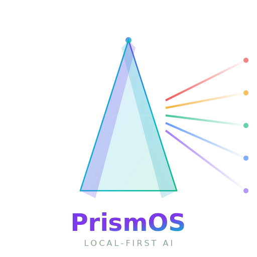
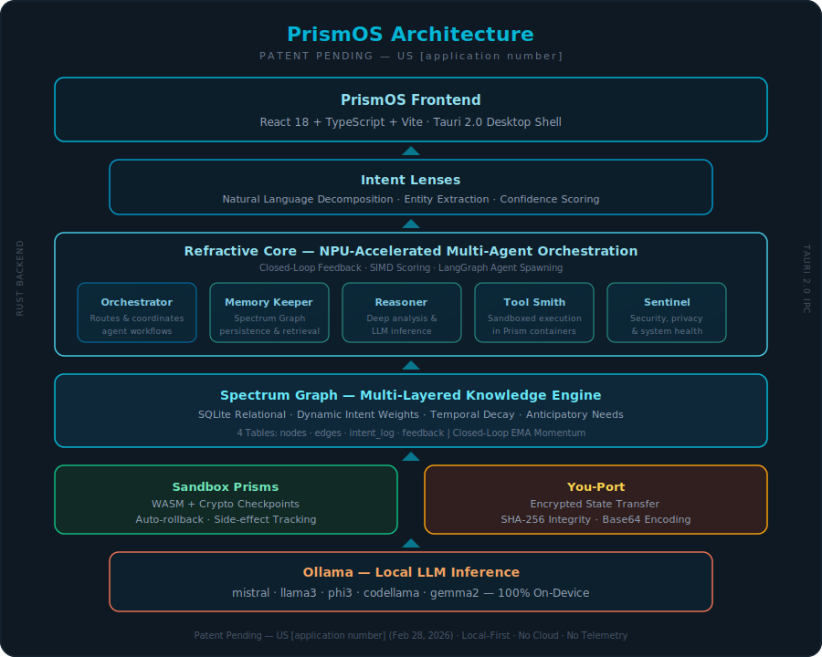

<p align="center">
  
</p>

<h1 align="center">PrismOS</h1>

<p align="center">
  <strong>Local-First Agentic Personal AI Operating System</strong><br/>
  <em>Patent Pending — US [application number] (Feb 28, 2026)</em>
</p>

<p align="center">
  <a href="LICENSE"></a>
  <a href="https://tauri.app"></a>
  <a href="https://ollama.com"></a>
  <a href="https://www.rust-lang.org"></a>
  <a href="https://react.dev"></a>
</p>

---

## 🔮 What is PrismOS?

PrismOS is a **local-first agentic personal AI operating system** that keeps all your data on your device. It combines a multi-agent orchestration engine (**Refractive Core**), a persistent multi-layered knowledge graph (**Spectrum Graph**), sandboxed execution (**Prism Sandboxes**), and natural language understanding (**Intent Lenses**) — all powered by local LLM inference via Ollama.

**No cloud. No telemetry. No data leaves your machine.**

### ✨ Key Highlights

- 🧠 **NPU-Accelerated Scoring** — SIMD-optimized (AVX2/NEON) cosine similarity for agent selection
- 🔁 **Closed-Loop Feedback** — Exponential Moving Average (EMA) momentum on knowledge edges
- 📊 **Force-Directed Graph Visualization** — Interactive `react-force-graph-2d` with facet coloring, weight-proportional edges, and live metrics
- 🔮 **Anticipatory Needs Engine** — Predicts next user needs from momentum edges, orphan nodes, and intent patterns
- 🛡️ **25+ Tauri IPC Commands** — Fully wired Rust ↔ React bridge with zero dead code
- 🎨 **Real SVG Branding** — Custom prism logo and icon with gradient fills and glow effects

---

## 🏗️ Architecture

<p align="center">
  
</p>

The architecture follows a **6-layer stack** from the patent specification:

| Layer | Component | Status |
|-------|-----------|--------|
| **L1** | PrismOS Frontend — React 18 + TypeScript + Vite, Tauri 2.0 desktop shell | ✅ Implemented |
| **L2** | Intent Lenses — NLU decomposition, entity extraction, confidence scoring | ✅ Implemented |
| **L3** | Refractive Core — NPU-accelerated multi-agent orchestration (5 agents) | ✅ Implemented |
| **L4** | Spectrum Graph — SQLite 4-table knowledge graph with feedback loops | ✅ Implemented |
| **L5** | Sandbox Prisms + You-Port — Execution sandbox & encrypted state transfer | ✅ Stub |
| **L6** | Ollama — Local LLM inference (mistral, llama3, phi3, codellama, gemma2) | ✅ Integrated |

---

## 🚀 Quick Start

### Prerequisites

- **Node.js** ≥ 18
- **Rust** ≥ 1.75 (with cargo)
- **Ollama** — [Install from ollama.com](https://ollama.com)
- **A local model** — e.g., `ollama pull mistral`

### Setup

```bash
# 1. Clone the repository
git clone https://github.com/mkbhardwas12/prismos-ai.git
cd prismos-ai

# 2. Install dependencies
npm install

# 3. Start Ollama (in a separate terminal)
ollama serve

# 4. Pull a model (if you haven't already)
ollama pull mistral

# 5. Run PrismOS
npm run tauri dev
```

> **Windows Note:** Ensure Rust's cargo is in your PATH. If not, run:
> `$env:PATH = "$env:USERPROFILE\.cargo\bin;$env:PATH"` before `npm run tauri dev`.

---

## 🧠 Core Components

### Refractive Core — NPU-Accelerated Multi-Agent Orchestration

The Refractive Core implements an **8-step pipeline** per the patent specification:

```
Intent → Graph Context → NPU Scoring → Agent Selection → LLM Inference
     → Feedback Loop → Conversation Storage → Anticipations
```

**NPU Scorer** detects hardware capabilities at startup (AVX2 / NEON / CPU fallback) and uses SIMD-optimized cosine similarity for real-time agent ranking.

| Agent | Role |
|-------|------|
| **Orchestrator** | Decomposes intents, routes & coordinates agent workflows |
| **Memory Keeper** | Manages Spectrum Graph persistence, retrieval & feedback |
| **Reasoner** | Deep analysis & LLM inference via Ollama |
| **Tool Smith** | Executes sandboxed operations in Prism containers |
| **Sentinel** | Monitors security, privacy & system health |

### Spectrum Graph — Multi-Layered Knowledge Engine

A fully implemented **persistent knowledge graph** stored in SQLite (WAL mode) with 4 tables:

| Table | Purpose |
|-------|---------|
| `nodes` | Knowledge entities with facets (knowledge, preference, context, skill, memory), access tracking |
| `edges` | Weighted relationships with **EMA momentum** (α = 0.3), closed-loop reinforcement |
| `intent_log` | Temporal intent history for pattern analysis and anticipatory predictions |
| `feedback` | Explicit user feedback (+1 / −1) driving edge weight updates |

**Key Algorithms:**
- **`query_intent()`** — 3-phase retrieval: text match → graph traversal → temporal boosting with recency scoring
- **`anticipate_needs()`** — 3 strategies: high-momentum edges, orphan node discovery, intent frequency patterns
- **`decay_all_edges()`** — Temporal decay (factor 0.95) to naturally deprecate stale knowledge
- **`update_edge_weight()`** — Closed-loop feedback with EMA momentum for adaptive learning

### Intent Lenses (NLU Decomposition)
Natural language input → structured intent with type classification (query, command, creative, analysis), entity extraction, and confidence scoring.

### Sandbox Prisms (Safe Execution)
WASM-based sandboxed environments with:
- Cryptographic state checkpoints (SHA-256)
- Auto-rollback on failure
- Side-effect tracking

### You-Port (State Transfer)
Encrypted local state export/import for device handoff with SHA-256 integrity verification and Base64 encoding.

---

## 🖥️ Frontend

### 5-Tab Navigation
| Tab | Component | Description |
|-----|-----------|-------------|
| 💬 Chat | `MainView.tsx` | Intent Console with conversation history & Ollama streaming |
| 📊 Graph | `SpectrumGraphView.tsx` | Force-directed graph visualization with `react-force-graph-2d` |
| 🔬 Spectrum | `SpectrumExplorer.tsx` | Full CRUD explorer for Spectrum Graph nodes |
| 🧪 Sandbox | `SandboxPanel.tsx` | Create, execute, and rollback sandboxed operations |
| ⚙️ Settings | `SettingsPanel.tsx` | Model selection, configuration & about |

### Spectrum Graph Visualization
Interactive force-directed graph powered by `react-force-graph-2d`:
- **Facet-colored nodes** — Each knowledge facet gets a distinct color
- **Weight-proportional edges** — Thicker = stronger relationship
- **Momentum coloring** — Green (positive) / Red (negative) edge momentum
- **Click-to-select** detail panel with node metadata
- **Reinforce / Weaken** buttons for manual edge feedback
- **Anticipated Needs** panel showing predicted next queries
- **Live metrics** bar (total nodes, edges, avg weight, feedback count)

---

## 📁 Project Structure

```
prismos-ai/
├── src/                            # React + TypeScript frontend
│   ├── assets/                     # Visual assets
│   │   ├── prismos-logo.svg        # Full prism logo (prism + spectrum beams + text)
│   │   └── prismos-icon.svg        # Compact 64×64 prism icon
│   ├── components/                 # UI components
│   │   ├── Sidebar.tsx             # 5-tab navigation + mini graph summary
│   │   ├── MainView.tsx            # Intent console + conversation history
│   │   ├── IntentInput.tsx         # Natural language input with submit
│   │   ├── ActiveAgents.tsx        # Agent status indicators
│   │   ├── SpectrumGraphView.tsx   # Force-directed graph (react-force-graph-2d)
│   │   ├── SpectrumExplorer.tsx    # Spectrum Graph CRUD explorer
│   │   ├── SandboxPanel.tsx        # Execution sandbox UI
│   │   └── SettingsPanel.tsx       # Configuration & about
│   ├── lib/                        # Client libraries
│   │   ├── ollama.ts               # Ollama TypeScript client (streaming)
│   │   └── agents.ts               # Agent definitions & status
│   ├── types/
│   │   └── index.ts                # All TypeScript types (GraphSnapshot, RefractiveResult, etc.)
│   ├── App.tsx                     # Main app with 5-tab routing
│   ├── App.css                     # Full dark theme (~1500 lines)
│   └── main.tsx                    # Entry point
├── src-tauri/                      # Rust backend (Tauri 2.0)
│   ├── src/
│   │   ├── lib.rs                  # 25+ Tauri IPC commands & app setup
│   │   ├── refractive_core.rs      # NPU-accelerated 8-step pipeline (~400 lines)
│   │   ├── spectrum_graph.rs       # Multi-layered knowledge graph (~700 lines)
│   │   ├── sandbox_prism.rs        # WASM sandbox with crypto checkpoints
│   │   ├── intent_lens.rs          # NLU decomposition engine
│   │   ├── ollama_bridge.rs        # Ollama HTTP client (reqwest)
│   │   └── you_port.rs             # Encrypted state transfer (SHA-256)
│   ├── Cargo.toml                  # Rust deps: rusqlite, reqwest, serde, sha2, base64
│   └── tauri.conf.json             # Tauri config (1200×800, dark theme)
├── agents/                         # Python LangGraph agents
│   ├── graph.py                    # Multi-agent graph definition
│   └── requirements.txt            # Python dependencies
├── docs/
│   └── architecture.svg            # Architecture diagram
└── package.json                    # Node deps: react, vite, tauri-cli, react-force-graph-2d
```

---

## 🔌 Tauri IPC Commands (25+)

All Rust backend functions are exposed as Tauri commands with zero dead code:

| Category | Commands |
|----------|----------|
| **Core Pipeline** | `route_intent`, `refract_intent` |
| **Spectrum Graph CRUD** | `add_spectrum_node`, `get_spectrum_node`, `search_spectrum_nodes`, `delete_spectrum_node`, `update_spectrum_node` |
| **Spectrum Graph Patent** | `get_spectrum_graph`, `update_edge_weight`, `query_spectrum_intent`, `anticipate_needs`, `get_graph_metrics`, `decay_graph_edges` |
| **Agents** | `get_agent_status`, `get_all_agents` |
| **Ollama** | `check_ollama`, `query_ollama`, `list_ollama_models` |
| **Sandbox** | `create_sandbox`, `execute_in_sandbox`, `rollback_sandbox`, `get_sandbox_status` |
| **You-Port** | `export_state`, `import_state` |
| **Intent** | `decompose_intent` |

---

## 🗺️ Roadmap

### ✅ Completed (v0.1)
- [x] MVP skeleton with Tauri 2.0 + React 18 + Rust backend
- [x] Ollama integration for local LLM inference (streaming)
- [x] SQLite-backed Spectrum Graph with 4 tables (nodes, edges, intent_log, feedback)
- [x] 5-agent Refractive Core with NPU-accelerated scoring
- [x] Intent Lens NLU decomposition engine
- [x] 25+ Tauri IPC commands — fully wired, zero dead code
- [x] Force-directed graph visualization with `react-force-graph-2d`
- [x] Closed-loop feedback with EMA momentum on edges
- [x] Anticipatory Needs engine (3 prediction strategies)
- [x] Spectrum Explorer — full CRUD for graph nodes
- [x] Sandbox Panel — create, execute, rollback UI
- [x] SVG branding — custom prism logo & icon with gradient fills
- [x] 5-tab navigation (Chat, Graph, Spectrum, Sandbox, Settings)
- [x] Dark theme UI with ~1500 lines of custom CSS

### 🔜 Next (v0.2–v0.3)
- [ ] LanceDB vector search integration for semantic retrieval
- [ ] Full LangGraph Python sidecar orchestration
- [ ] WASM sandbox execution engine (real isolation)
- [ ] Auto-rollback with cryptographic checkpoints
- [ ] Multi-model support with model-specific routing

### 🔮 Future (v0.4+)
- [ ] You-Port encrypted state transfer (AES-256-GCM)
- [ ] Plugin system for community extensions
- [ ] Voice input/output via local Whisper + TTS
- [ ] Mobile companion app (Tauri Mobile)
- [ ] Production release with full patent implementation

---

## ⚖️ Legal

**Patent Pending — US Provisional Patent Application No. [application number]**
Filed: February 28, 2026
Title: PrismOS — Local-First Agentic Personal AI Operating System

## 📄 License

MIT — see [LICENSE](LICENSE) for details.

---

<p align="center">
  <br/>
  <em>Built by PrismOS Contributors — Your AI, Your Device, Your Data.</em>
</p>
