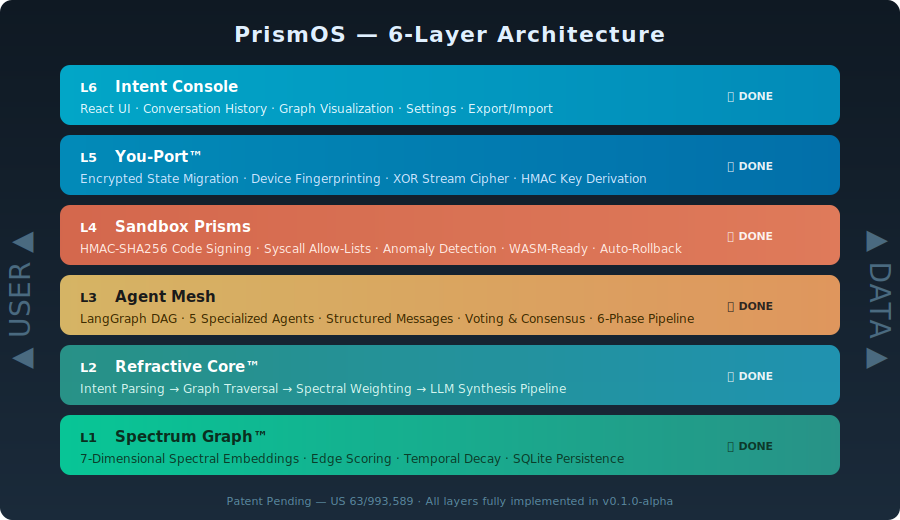
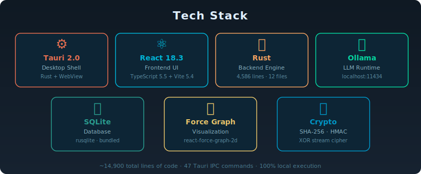
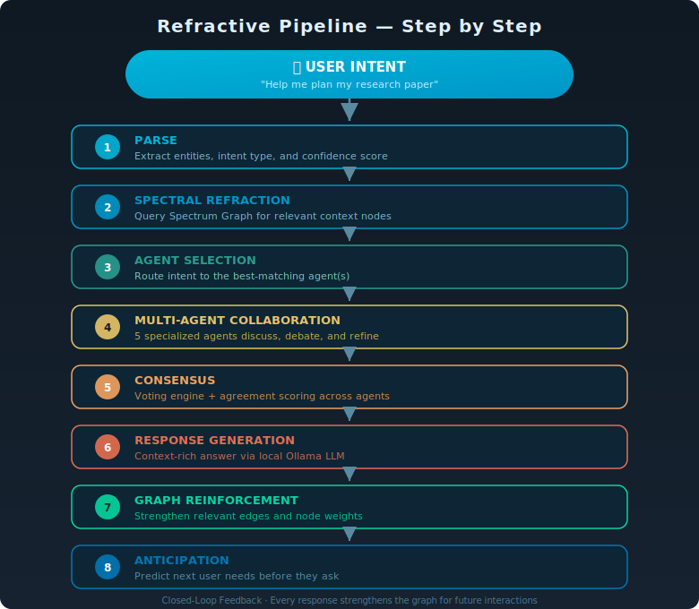
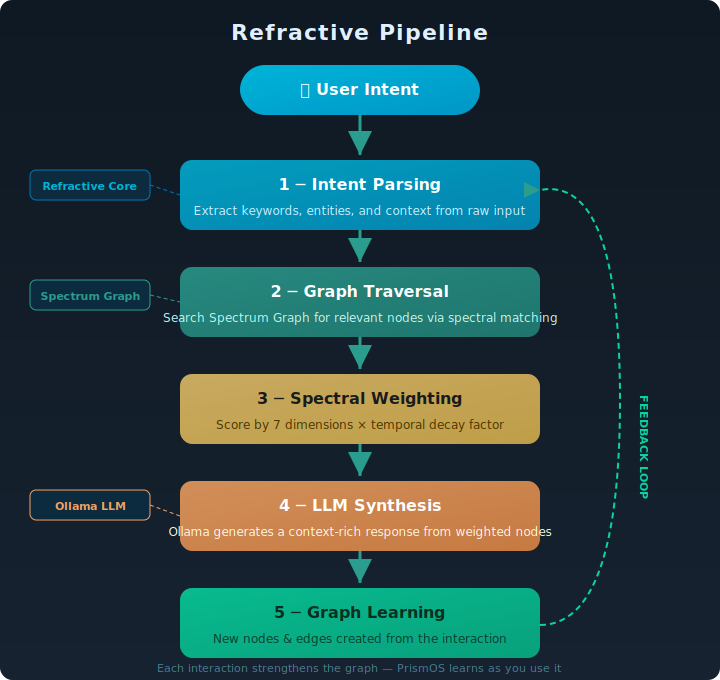
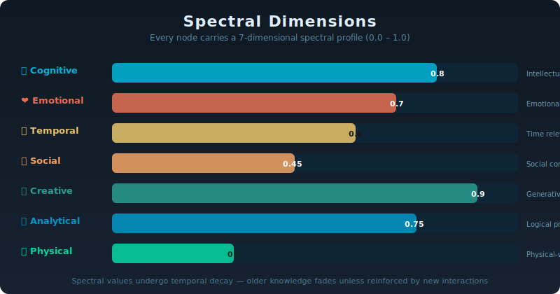
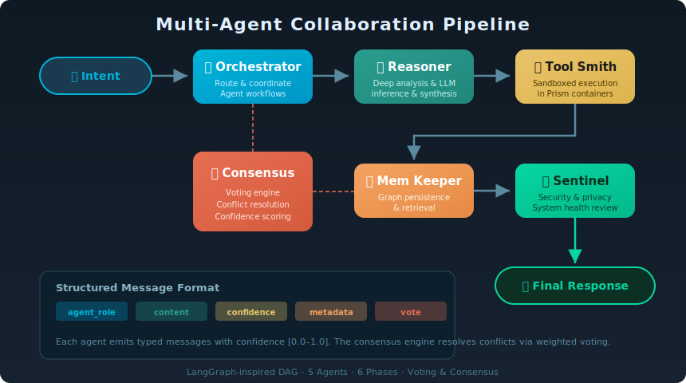
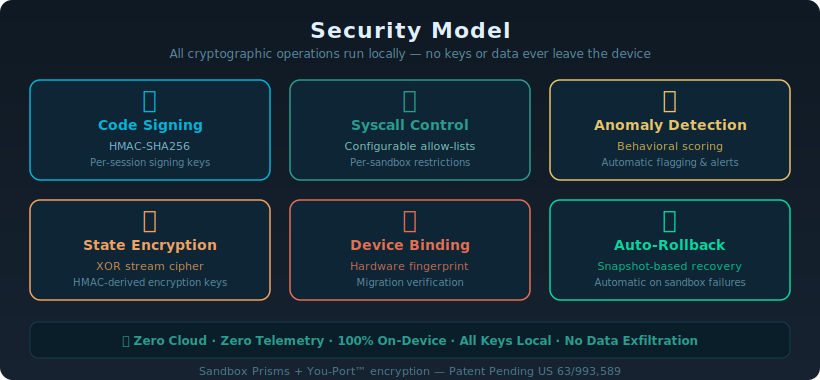

<p align="center">
  
</p>

<h1 align="center">🔷 PrismOS</h1>

<p align="center">
  <strong>The Local-First AI Operating System</strong><br/>
  <sub>Your AI. Your Data. Your Machine. Period.</sub>
</p>

<p align="center">
  <a href="https://github.com/mkbhardwas12/prismos-ai"></a>
  
  
  
</p>

<p align="center">
  
  
  
  
  
</p>

<p align="center">
  A fully local, privacy-first AI operating system that learns and evolves with you.<br/>
  Built on the <strong>Spectrum Graph™</strong> — a patent-pending 7-dimensional knowledge representation<br/>
  that refracts every interaction into spectral dimensions of meaning.
</p>

<p align="center">
  <a href="#-quick-start">⚡ Quick Start</a> ·
  <a href="#-features">✨ Features</a> ·
  <a href="#-architecture">🏗️ Architecture</a> ·
  <a href="#-screenshots">📸 Screenshots</a> ·
  <a href="#-roadmap">🛤️ Roadmap</a> ·
  <a href="#-contributing">🤝 Contributing</a>
</p>

---

## ⚡ What is PrismOS?

> **In one sentence:** A Tauri 2.0 desktop app with 5 AI agents, a physics-inspired 7D knowledge graph, WASM sandboxing, 9 security layers, and a modern glassmorphism UI — all running 100% offline.

PrismOS is a **desktop AI operating system** that runs **entirely on your machine** — no cloud, no telemetry, no data leaving your device. It combines:

| Feature | Description |
|---------|-------------|
| **Spectrum Graph™** | Persistent multi-dimensional knowledge graph |
| **Refractive Core™** | Intent processing through spectral analysis |
| **Multi-Agent Collaboration** | Five specialized AI agents (Orchestrator, Reasoner, Tool Smith, Memory Keeper, Sentinel) that collaborate via structured messaging, voting, debate, and consensus |
| **Sandbox Prisms** | WASM-based isolated execution environments with HMAC-SHA256 verification, allow-lists, fuel metering, and auto-rollback |
| **You-Port™** | Encrypted personality migration |
| **Voice I/O** | Hands-free interaction via Web Speech API — all processing stays on your device |
| **100% Local** | Powered by Ollama running local LLMs (Mistral, Llama, etc.) |

---

## 🚀 Quick Start

### Prerequisites

| Tool | Version | Install |
|------|---------|---------|
| **Node.js** | ≥ 18 | [nodejs.org](https://nodejs.org/) |
| **Rust** | ≥ 1.75 | [rustup.rs](https://rustup.rs/) |
| **Ollama** | Latest | [ollama.com](https://ollama.com/) |

> **Windows users**: Install the [Visual Studio C++ Build Tools](https://visualstudio.microsoft.com/visual-cpp-build-tools/) if you haven't already (required by Rust/Tauri).

### Step-by-Step Setup

```bash
# 1. Clone the repository
git clone https://github.com/mkbhardwas12/prismos-ai.git
cd prismos-ai

# 2. Install frontend dependencies
npm install

# 3. Pull a local model (Mistral recommended for best results)
ollama pull mistral

# 4. Start Ollama (keep this running in a separate terminal)
ollama serve

# 5. Launch PrismOS in development mode
npm run tauri dev
```

> **First launch** takes ~2–3 minutes to compile Rust. Subsequent launches are instant.

### Build for Production

```bash
# Build optimized release binary + installer
npm run tauri build
```

The installer will be generated in `src-tauri/target/release/bundle/`:

| Platform | Installer |
|----------|-----------|
| Windows  | `.msi` + `.exe` |
| macOS    | `.dmg` + `.app` |
| Linux    | `.deb` + `.AppImage` |

### Verify the Build

```bash
# Frontend type-check
npx tsc --noEmit

# Frontend production build
npx vite build

# Rust compile check
cd src-tauri && cargo check

# Rust tests
cd src-tauri && cargo test
```

---

## ✨ Features

### 🧠 Refractive Core Pipeline

Every intent you express is processed through a multi-stage pipeline:

```
User Intent → Parse → Spectral Analysis → Agent Selection → Multi-Agent Collaboration
     → Debate & Consensus → Response Generation → Graph Reinforcement → Anticipation
```

The Refractive Core doesn't just answer — it **learns**, **anticipates**, and **evolves** your personal knowledge graph with every interaction.

### 🌈 Spectrum Graph

A persistent, multi-layered knowledge graph where every node carries **7 spectral dimensions**:

| Dimension | Description |
|-----------|-------------|
| Cognitive | Intellectual complexity and depth |
| Emotional | Sentiment and emotional resonance |
| Temporal | Time relevance and decay |
| Social | Interpersonal and social context |
| Creative | Originality and creative associations |
| Analytical | Logical structure and reasoning |
| Physical | Physical world connections |

Nodes are organized into **3 layers**: Core (permanent), Context (session), Ephemeral (temporary).

### 🤖 Multi-Agent Collaboration (LangGraph-style)

Five specialized agents work together using a formal state-graph workflow:

| Agent | Role | Specialty |
|-------|------|-----------|
| **Orchestrator** | Coordinator | Routes intents and coordinates agent workflows |
| **Reasoner** | Analysis | Deep reasoning, LLM inference, and knowledge synthesis |
| **Tool Smith** | Execution | Generates solutions and executes sandboxed operations |
| **Memory Keeper** | Persistence | Manages Spectrum Graph storage and retrieval |
| **Sentinel** | Security | Reviews actions for safety, privacy, and system health |

Agents collaborate through **structured debate** with argument types (Position, Challenge, Rebuttal, Support, Concession) and reach consensus through voting.

### 🔒 Sandbox Prisms (WASM Isolation)

All agent actions execute inside **WASM-isolated sandboxes** powered by wasmtime:

- **HMAC-SHA256 signing** — Every action is cryptographically signed
- **Allow-list enforcement** — Only approved operations execute
- **Fuel metering** — Bounded computation prevents runaway processes
- **Memory limits** — Hard memory boundaries per sandbox
- **Auto-rollback** — Failed actions automatically revert to last checkpoint
- **Zero ambient authority** — Sandboxes cannot access the filesystem, network, or system

### 🔐 You-Port™ (Multi-Device Sync)

Encrypted state migration with **graph merge/diff** for multi-device sync:

- **Export** — Passphrase-encrypted sync packages (`.prismos-sync`)
- **Preview** — See the diff before applying (nodes/edges only-local, only-remote, conflicted)
- **Merge Strategies** — Latest Wins, Theirs Wins, Ours Wins
- **Conflict Resolution** — Automatic per-field conflict resolution with full audit trail
- **Device-bound encryption** — Session state encrypted to your device fingerprint

### 🎙️ Voice I/O

Hands-free interaction via the Web Speech API:

- **Speech-to-Text** — Speak your intents naturally
- **Text-to-Speech** — Hear AI responses spoken aloud
- **100% Local** — All voice processing uses the browser's built-in engine
- **Interim transcripts** — See what PrismOS hears in real-time

### 🪟 Multi-Window Support

Open any view in a separate window:

- Spectrum Graph in its own window for multi-monitor setups
- Spectral Timeline in a dedicated window
- Each window runs independently with hash-based routing

---

## 🏗️ Architecture

PrismOS follows a **6-layer architecture** as described in the patent:

<p align="center">
  
</p>

### Tech Stack

| Layer | Technology | Purpose |
|-------|-----------|---------|
| **Desktop Shell** | Tauri 2.0 | Native window, IPC, system integration |
| **Frontend** | React 18 + TypeScript 5.5 | UI components, state management |
| **Build** | Vite 5.4 | Hot reload, production builds |
| **Backend** | Rust 1.75+ | All business logic, graph engine, security |
| **Database** | SQLite (rusqlite 0.31) | Persistent graph storage |
| **AI Inference** | Ollama | Local LLM serving (Mistral, Llama, etc.) |
| **Sandbox** | wasmtime 27 | WASM isolation for agent actions |
| **Visualization** | react-force-graph-2d | Force-directed graph rendering |

<p align="center">
  
</p>

---

## 📸 Screenshots

> **Screenshots coming soon.** PrismOS v0.2.0 features a modern glassmorphism dark UI with full light theme support.

| # | View | What You'll See |
|:-:|------|----------------|
| 1 | **🧠 Intent Console** | Natural language chat with AI metadata, collaboration traces, and guided Ollama setup wizard |
| 2 | **🌈 Spectrum Graph** | Force-directed knowledge graph with spectral coloring and multi-window pop-out |
| 3 | **🔍 Spectrum Explorer** | Node browser with CRUD, search, and spectral dimension details |
| 4 | **🛡️ Sandbox Prisms** | Code execution sandbox with results, rollback, and WASM status |
| 5 | **⏳ Spectral Timeline** | Time-based graph history with date grouping and snapshot restore |
| 6 | **⚙️ Settings & Security** | Configuration, encrypted export/import, sync, live security dashboard |
| 7 | **💬 Agent Debate** | Live debate panel with argument types and agreement scoring |

---

## 📁 Project Structure

```
PrismOS/
├── src/                          # React frontend (TypeScript)
│   ├── App.tsx                   # Main shell, routing, startup
│   ├── App.css                   # Global design system (3,770+ lines)
│   ├── main.tsx                  # React entry point
│   ├── components/
│   │   ├── MainView.tsx          # Intent Console + conversation
│   │   ├── SettingsPanel.tsx     # Settings, sync, export/import
│   │   ├── Sidebar.tsx           # Navigation with agent status
│   │   ├── IntentInput.tsx       # Text + voice input
│   │   ├── ActiveAgents.tsx      # Agent cards + debate panel
│   │   ├── SandboxPanel.tsx      # Sandbox Prisms dashboard
│   │   ├── SpectrumExplorer.tsx  # Graph node browser
│   │   ├── SpectrumGraphView.tsx # Force-directed visualization
│   │   └── SpectralTimeline.tsx  # Timeline view
│   ├── hooks/
│   │   └── useVoice.ts           # Web Speech API hook
│   ├── lib/
│   │   ├── agents.ts             # Agent Tauri bindings
│   │   └── ollama.ts             # Ollama API client
│   ├── types/
│   │   └── index.ts              # TypeScript definitions (340 lines)
│   └── assets/                   # Icons, logos, SVGs
│
├── src-tauri/                    # Rust backend (Tauri 2.0)
│   ├── Cargo.toml                # Rust dependencies
│   ├── tauri.conf.json           # Tauri config (v0.2.0)
│   ├── capabilities/             # Tauri 2.0 permissions
│   └── src/
│       ├── lib.rs                # 53 Tauri IPC commands
│       ├── main.rs               # Tauri entry point
│       ├── spectrum_graph.rs     # Spectrum Graph™ engine
│       ├── refractive_core.rs    # Refractive Core™ pipeline
│       ├── intent_lens.rs        # Intent parsing & classification
│       ├── sandbox_prism.rs      # Sandbox Prisms + WASM isolation
│       ├── you_port.rs           # You-Port™ encrypted migration
│       ├── ollama_bridge.rs      # Ollama HTTP client
│       ├── audit_log.rs          # Tamper-evident SHA-256 hash chain
│       ├── model_verify.rs       # LLM integrity verification
│       ├── secure_enclave.rs     # Hardware security module abstraction
│       └── agents/               # LangGraph multi-agent system
│           ├── mod.rs            # Module exports
│           ├── graph.rs          # DAG execution engine
│           ├── messages.rs       # Structured message types
│           ├── nodes.rs          # 5 agent implementations
│           └── langgraph_workflow.rs  # State-graph + debate engine
│
├── agents/                       # Python agent prototypes
│   ├── prismos_agents.py         # Agent CLI runner
│   ├── tool_smith.py             # Tool Smith sandbox stub
│   └── requirements.txt          # Python dependencies
├── tests/                        # Test documentation
│   └── README.md                 # Manual test checklist
├── docs/                         # Architecture diagrams
│   ├── architecture.svg          # Full architecture diagram
│   └── diagrams/                 # SVG diagrams (8 files)
├── CHANGELOG.md                  # Version history
├── CONTRIBUTING.md               # Contributor guide
├── LICENSE                       # MIT License
├── README.md                     # This file
└── package.json                  # Node.js config
```

---

## 🔌 Tauri IPC Commands

PrismOS exposes **53 Tauri commands** for frontend–backend communication:

<details>
<summary>Click to expand full command list (53 commands)</summary>

| Category | Command | Description |
|----------|---------|-------------|
| **Refractive Core** | `refract_intent` | Full Refractive Core pipeline with collaboration |
| **Core** | `process_intent` | Intent processing |
| **Core** | `process_intent_full` | Full pipeline with metadata |
| **Core** | `get_graph_stats` | Node/edge counts |
| **Core** | `check_ollama_status` | Verify Ollama connectivity |
| **Core** | `query_ollama` | Direct LLM query |
| **Graph CRUD** | `add_spectrum_node` | Add node to Spectrum Graph |
| **Graph CRUD** | `add_spectrum_edge` | Add weighted edge |
| **Graph CRUD** | `get_spectrum_node` | Get node by ID |
| **Graph CRUD** | `get_spectrum_nodes` | List all nodes |
| **Graph CRUD** | `get_spectrum_graph` | Get full graph snapshot |
| **Graph CRUD** | `search_spectrum_nodes` | Full-text search |
| **Graph CRUD** | `delete_spectrum_node` | Remove node + edges |
| **Graph CRUD** | `get_node_connections` | Get neighboring nodes |
| **Graph CRUD** | `update_edge_weight` | Reinforce edge weight |
| **Graph CRUD** | `update_spectrum_node` | Update node content |
| **Spectral** | `query_spectrum_intent` | Spectral intent query |
| **Spectral** | `anticipate_needs` | Anticipatory intelligence |
| **Spectral** | `get_graph_metrics` | Graph analytics |
| **Spectral** | `decay_graph_edges` | Temporal edge decay |
| **Persistence** | `persist_graph` | Save to SQLite |
| **Persistence** | `load_graph` | Load from SQLite |
| **Persistence** | `get_feedback_count` | Feedback statistics |
| **Persistence** | `get_recent_intents` | Recent intent log |
| **Persistence** | `export_graph` | Encrypted export |
| **Persistence** | `import_graph` | Encrypted import |
| **Persistence** | `clear_graph` | Clear all data |
| **Agents** | `get_active_agents` | List agent status |
| **Agents** | `run_collaboration` | Execute LangGraph workflow |
| **Agents** | `get_workflow_graph` | Get workflow DAG |
| **Agents** | `get_debate_log` | Get debate transcript |
| **Ollama** | `list_ollama_models` | Available models |
| **Ollama** | `launch_ollama` | Start Ollama process |
| **Ollama** | `pull_ollama_model` | Pull model via API |
| **Sandbox** | `create_sandbox` | Create sandbox instance |
| **Sandbox** | `execute_sandbox` | Run in sandbox |
| **Sandbox** | `execute_in_sandbox` | Execute WASM module |
| **Sandbox** | `rollback_sandbox` | Rollback to checkpoint |
| **You-Port** | `export_you_port` | Export You-Port package |
| **You-Port** | `import_you_port` | Import You-Port package |
| **You-Port** | `save_state` | Encrypt + save state |
| **You-Port** | `load_state` | Decrypt + load state |
| **You-Port** | `has_saved_state` | Check for saved state |
| **Multi-Window** | `open_graph_window` | Open view in new window |
| **Timeline** | `get_timeline_data` | Fetch timeline events |
| **Sync** | `export_sync_package` | Passphrase-encrypted export |
| **Sync** | `import_sync_package` | Merge sync package |
| **Sync** | `preview_sync_merge` | Preview merge diff |
| **Sync** | `diff_graph` | Compute graph diff |
| **Security** | `get_audit_log` | Tamper-evident audit entries |
| **Security** | `verify_audit_chain` | Verify hash chain integrity |
| **Security** | `verify_model` | SHA-256 model verification |
| **Security** | `get_security_status` | Full security status report |

</details>

---

## 🧠 How It Works

### The Refractive Pipeline

<p align="center">
  
</p>

<p align="center">
  
</p>

### Spectral Dimensions

<p align="center">
  
</p>

### Multi-Agent Collaboration

<p align="center">
  
</p>

---

## 🔐 Security Model — 9 Layers of Defense

<p align="center">
  
</p>

> Security isn't a feature — it's the architecture.

| # | Layer | Mechanism | What It Does |
|:-:|-------|-----------|-------------|
| 1 | **Cryptographic** | HMAC-SHA256 | Every agent action is cryptographically signed |
| 2 | **Behavioral** | Allow-lists | Only whitelisted operations can execute |
| 3 | **Runtime** | wasmtime WASM | Code runs in sandboxes with memory + CPU limits |
| 4 | **Anomaly** | Statistical detection | Flags unusual patterns automatically |
| 5 | **Recovery** | Auto-rollback | Failed actions revert to last checkpoint |
| 6 | **Encryption** | XOR stream cipher + HMAC | All state encrypted at rest |
| 7 | **Audit** | SHA-256 hash chain | Tamper one entry, break the entire chain |
| 8 | **Model Integrity** | SHA-256 fingerprinting | LLM models checked against known-good registry |
| 9 | **Hardware** | TPM / Secure Enclave | Hardware-backed key derivation |
---

## 🗺️ Roadmap

### v0.1.0-alpha ✅ (Feb 2026)

- [x] Spectrum Graph with 7-dimensional spectral embeddings
- [x] SQLite persistence with full CRUD
- [x] Refractive Core intent pipeline
- [x] Ollama integration (Mistral, Llama, etc.)
- [x] React UI with Intent Console
- [x] Force-directed graph visualization
- [x] LangGraph multi-agent collaboration (5 agents)
- [x] Sandbox Prisms with HMAC signing and anomaly detection
- [x] You-Port encrypted state migration
- [x] Settings page with encrypted export/import
- [x] Startup loading screen with progress
- [x] Error handling with contextual guidance

### v0.2.0 (Current) ✅ (Mar 2, 2026)

- [x] WASM-based sandbox isolation (full wasmtime containment)
- [x] Voice input/output integration (Web Speech API)
- [x] Multi-window support (Tauri WebviewWindowBuilder)
- [x] Spectral timeline visualization (time-based graph history)
- [x] LangGraph Workflow Engine (formal state-graph, debate rounds)
- [x] Graph merge/diff for multi-device sync
- [x] Accessibility polish (ARIA, focus management, reduced motion)
- [x] Release readiness (CHANGELOG, CONTRIBUTING, test docs)
- [x] Light theme + theme persistence (localStorage)
- [x] Responsive sidebar with hamburger menu (<768px)
- [x] Keyboard shortcuts (Ctrl+1–6 view navigation)
- [x] Form labels, keyboard-accessible cards, 2-click delete
- [x] Settings persistence across restarts
- [x] UTF-8 safety fixes (prevent panics on multi-byte content)
- [x] Consensus voting improvements (ToolSmith + MemoryKeeper)
- [x] Modern blue glassmorphism UI overhaul (eliminate legacy colors)
- [x] Guided Ollama onboarding wizard (Install → Start → Pull Model)
- [x] Collapsible setup wizard with compact/expanded states
- [x] First-time setup modal (localStorage-gated, one-time only)
- [x] Clickable example intents on welcome screen
- [x] Security badge tooltips with plain-English explanations
- [x] Live Security Status dashboard in Settings
- [x] Welcoming input placeholder with privacy messaging
- [x] Tamper-evident audit log (SHA-256 hash chain)
- [x] LLM model verification (SHA-256 fingerprint vs known-good registry)
- [x] Hardware secure enclave abstraction (TPM/Secure Enclave + software fallback)
- [x] 53 Tauri IPC commands, 16 Rust modules, 4,100+ CSS lines

### v0.3.0 (Planned)

- [ ] Plugin system for third-party Prisms
- [ ] Federated learning (privacy-preserving cross-device)
- [ ] Custom model fine-tuning pipeline
- [ ] Mobile companion app (React Native)
- [ ] Spectral API for external integrations
- [ ] Automated E2E test suite (Playwright + Tauri WebDriver)

---

## 📊 Release Notes — v0.2.0

**Released:** March 2, 2026 · **Tag:** `v0.2.0` · **[Full Release Notes →](RELEASE_NOTES.md)**

### Highlights

| | Feature | Description |
|:-:|---------|------------|
| 🛡️ | **WASM Sandbox** | Agent actions run inside wasmtime with fuel metering + zero ambient authority |
| 🎙️ | **Voice I/O** | Speak intents, hear responses — all via local Web Speech API |
| 🪟 | **Multi-Window** | Pop out Spectrum Graph or Timeline to separate native windows |
| ⏳ | **Timeline** | Browse graph history with date grouping, search, and snapshot restore |
| 🔄 | **Merge/Diff** | Multi-device sync with conflict detection and 3 resolution strategies |
| ♥️ | **Accessibility** | ARIA roles, focus rings, reduced-motion, screen reader support |
| 🎨 | **Blue UI** | Modern glassmorphism dark theme + full light theme parity |
| 🔒 | **Security** | SHA-256 audit chain, model verification, hardware enclave abstraction |

### Stats

| Metric | Value |
|--------|-------|
| TypeScript files | 16 |
| Rust source files | 16 |
| CSS lines | 4,100+ |
| Tauri IPC commands | 53 |
| Agent count | 5 |
| Spectral dimensions | 7 |
| Total source lines | ~15,800+ |

---

## 🔷 What Makes PrismOS Different

Most local AI tools today are either simple chat interfaces or agent frameworks that still rely on the cloud.

PrismOS is built differently — it is the **first true local-first agentic personal operating system** with these patented innovations (filed February 2026):

- **Refractive Core** — Processes your intent like light passing through a prism: it decomposes the request across multiple dimensions, routes it through 5 collaborating agents, and reassembles a refined response.
- **Spectrum Graph** — A persistent, living 7-dimensional knowledge memory that evolves with every interaction and uses closed-loop feedback to anticipate your needs.
- **Sandbox Prisms** — Full WASM-based isolation with HMAC-SHA256 cryptographic signing, strict per-agent allow-lists, real-time anomaly detection, and automatic rollback with plain-English explanations.
- **You-Port Handoff** — Encrypted live state migration that lets your entire agent memory and graph travel securely between devices.
- **Complete Desktop Experience** — Voice input/output, multi-window support, Spectral Timeline visualization, and guided Ollama setup — all running 100% offline.

**Patent Pending** — US Provisional Patent filed February 2026.

> This is not just another AI chat — it's your personal AI operating system that actually remembers you.

---

## ⚖️ Patent Notice

**Patent Pending** — US Provisional Patent Application (filed February 2026).

PrismOS and its core architectures (Spectrum Graph, Refractive Core, and You-Port) are protected by a pending U.S. patent.  
This open-source release is for personal and educational use under the MIT License.  
Commercial use of the patented inventions requires a separate license.

Inventor: Manish Kumar

---

## 🧪 Testing

See [tests/README.md](tests/README.md) for the full test documentation including a manual test checklist.

```bash
# Run Rust backend tests
cd src-tauri && cargo test

# Frontend type-check
npx tsc --noEmit

# Full production build verification
npm run tauri build
```

---

## 🤝 Contributing

See [CONTRIBUTING.md](CONTRIBUTING.md) for detailed guidelines.

```bash
# Quick start for contributors
git clone https://github.com/mkbhardwas12/prismos-ai.git
cd prismos-ai
npm install
ollama pull mistral && ollama serve
npm run tauri dev
```

1. Fork the repository
2. Create a feature branch: `git checkout -b feature/amazing-feature`
3. Make your changes and verify the build
4. Commit with conventional commits: `git commit -m 'feat: add amazing feature'`
5. Push and open a Pull Request

---

## 📜 License

MIT License — see [LICENSE](LICENSE) for details.

Copyright © 2026 Manish Kumar

---

<div align="center">

---

**🔷 PrismOS** — Your mind, refracted.

*Patent Pending · Local-First · Privacy-First · Agentic AI*

**[⭐ Star on GitHub](https://github.com/mkbhardwas12/prismos-ai)** · **[📖 Release Notes](RELEASE_NOTES.md)** · **[🐛 Report a Bug](https://github.com/mkbhardwas12/prismos-ai/issues)**

*Built with the conviction that AI should serve its user, not a platform.*

</div>
