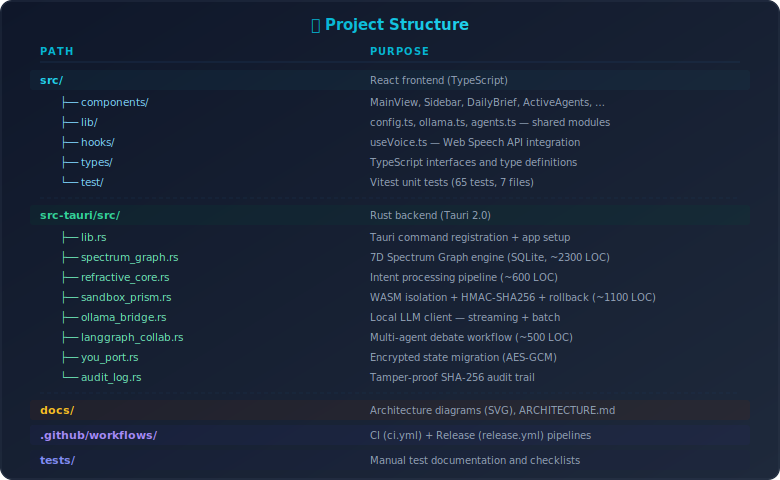

# PrismOS-AI — Local-First Agentic Personal AI Operating System

> **Try it in 30 seconds:** `git clone https://github.com/mkbhardwas12/prismos-ai.git && cd prismos-ai && npm install && npm run tauri dev`

[](https://github.com/mkbhardwas12/prismos-ai/actions/workflows/ci.yml)
[](https://github.com/mkbhardwas12/prismos-ai/releases/latest)
[](LICENSE)
[-blueviolet)](https://ollama.com)

**Patent Pending** — US Provisional Patent filed February 2026

PrismOS-AI is a **local-first agentic personal AI operating system** that runs 100% on your device. Your data never leaves your machine. Five collaborative AI agents work together via a formal debate pipeline, storing everything in a persistent 7-dimensional Spectrum Graph that grows with you.

<p align="center">
  
</p>

<details>
<summary><strong>📸 More Screenshots</strong> (click to expand)</summary>
<br />

| Spectrum Graph | Spectrum Explorer |
|:-:|:-:|
|  |  |

| Sandbox Prisms | Spectral Timeline |
|:-:|:-:|
|  |  |

<!-- 🔜 Add voice-input.png and security-audit.png here for 7 total screenshots:
| Voice Input | Security Audit Log |
|:-:|:-:|
|  |  |
-->

</details>

---

## ✨ Core Features (v0.2.1)

| Feature | Description |
|---------|-------------|
| **Refractive Core** | Intent → 5-agent pipeline → Spectrum Graph → response |
| **Spectrum Graph** | Persistent Multi-dimensional knowledge graph |
| **5 AI Agents** | Orchestrator, Memory Keeper, Reasoner, Tool Smith, Sentinel |
| **LangGraph Debates** | Multi-agent debate with formal consensus voting |
| **Sandbox Prism** | WASM-isolated execution with HMAC-SHA256 signing & auto-rollback |
| **Proactive Suggestions** | Context-aware cards that auto-process on click |
| **Morning Brief / Evening Recap** | Daily summary of your knowledge graph activity |
| **You-Port** | Encrypted state migration — export/import your entire graph |
| **Voice I/O** | Browser-native speech input/output (no cloud transcription) |
| **Spectral Timeline** | Time-series view of knowledge evolution |
| **Multi-Window** | Open Spectrum Graph in a separate window |

Everything runs offline. All inference via local [Ollama](https://ollama.com) models.

---

## 🏗️ Architecture

<p align="center">
  
</p>

See [docs/architecture.svg](docs/architecture.svg) and the [docs/diagrams/](docs/diagrams/) folder for detailed visual diagrams.

---

## 🚀 Quick Start

### Prerequisites

| Tool | Version | Purpose |
|------|---------|---------|
| [Node.js](https://nodejs.org/) | ≥ 18 | Frontend build |
| [Rust](https://rustup.rs/) | ≥ 1.75 | Tauri backend |
| [Ollama](https://ollama.com/) | Latest | Local LLM |

### Install & Run

```bash
# Clone the repository
git clone https://github.com/mkbhardwas12/prismos-ai.git
cd prismos-ai

# Install frontend dependencies
npm install

# Pull a local model (PrismOS-AI will guide you through this on first launch)
ollama pull mistral

# Start Ollama in the background
ollama serve &

# Run in development mode
npm run tauri dev
```

### Download Pre-Built Installers

Pre-built installers are available on the [Releases page](https://github.com/mkbhardwas12/prismos-ai/releases/latest):

- **Windows**: `.msi` or `.exe` installer
- **macOS**: `.dmg` (Apple Silicon & Intel)
- **Linux**: `.deb` or `.AppImage`

---

## 🔧 Configuration

PrismOS-AI uses [Ollama](https://ollama.com/) for local LLM inference. The default configuration:

| Setting | Default | Description |
|---------|---------|-------------|
| Ollama URL | `http://localhost:11434` | API endpoint for local Ollama |
| Default Model | `llama3.2` | Model used for inference |
| Theme | `dark` | UI theme (`dark` / `light`) |
| Max Tokens | `2048` | Max response length |

All settings are configurable in the Settings panel (⚙️) within the app. The Ollama URL constant is centralized in:
- **Frontend**: [`src/lib/config.ts`](src/lib/config.ts)
- **Backend**: [`src-tauri/src/ollama_bridge.rs`](src-tauri/src/ollama_bridge.rs) (`DEFAULT_OLLAMA_URL`)

---

## 🧪 Testing

```bash
# Frontend unit tests (Vitest + React Testing Library)
npx vitest run

# TypeScript type-check
npx tsc --noEmit

# Rust backend tests
cd src-tauri && cargo test

# Rust lint (clippy)
cd src-tauri && cargo clippy
```

CI runs automatically on every push and PR via [GitHub Actions](.github/workflows/ci.yml).

---

## 📁 Project Structure

<p align="center">
  
</p>

---

## 🔒 Security Model

PrismOS-AI implements defense-in-depth with patent-pending security:

1. **Sandbox Prism** — Every agent action runs inside an isolated WASM container
2. **HMAC-SHA256 Signing** — All actions are cryptographically signed
3. **Allow-List Enforcement** — Only pre-approved operations execute
4. **Auto-Rollback** — Anomalous actions are automatically reverted
5. **Audit Trail** — Tamper-proof chain of all operations
6. **Zero Ambient Authority** — Agents have no default permissions

See [docs/diagrams/security-model.svg](docs/diagrams/security-model.svg) for the full security flow.

---

## 🤝 Contributing

See [CONTRIBUTING.md](CONTRIBUTING.md) for development setup, code style, and contribution guidelines.

---

## 📜 Patent Notice

PrismOS-AI and its core architectures (Spectrum Graph, Refractive Core, Sandbox Prism, You-Port) are protected by a US Provisional Patent filed February 2026. This open-source release is for personal and educational use.

---

<p align="center">
  <strong>PrismOS-AI</strong> — Your mind, your machine, your OS.<br />
  <a href="https://github.com/mkbhardwas12/prismos-ai/releases/latest">Download</a> · <a href="https://github.com/mkbhardwas12/prismos-ai/issues">Report Bug</a> · <a href="https://github.com/mkbhardwas12/prismos-ai/issues">Request Feature</a>
</p>
