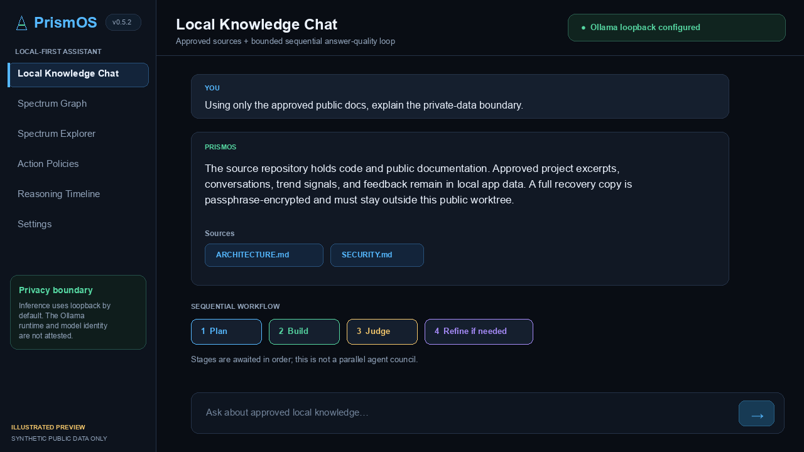
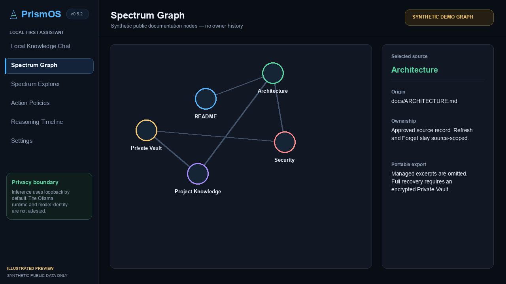
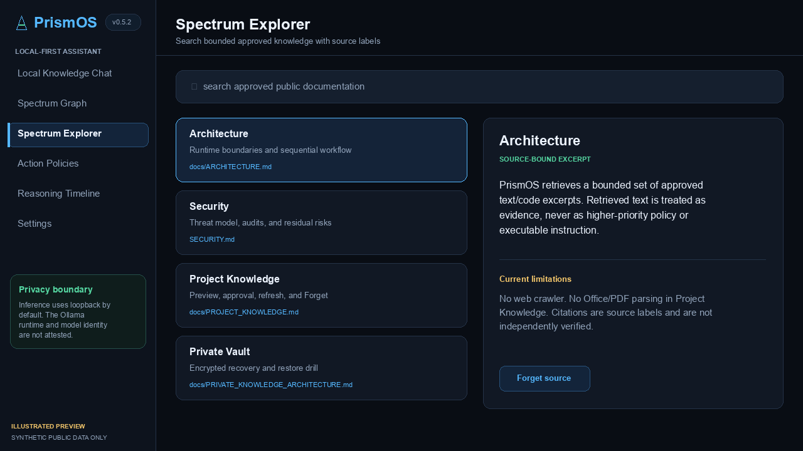
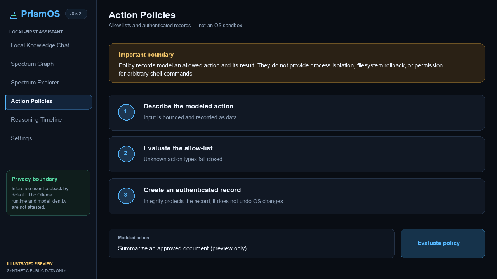
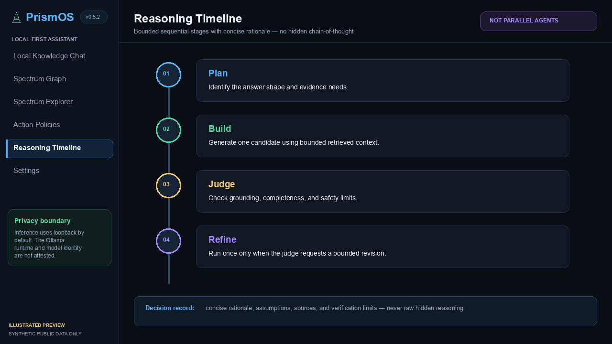

# PrismOS-AI — Local-First Agentic Personal AI Operating System

> **Try it in 30 seconds:** `git clone https://github.com/mkbhardwas12/prismos-ai.git && cd prismos-ai && npm install && npm run tauri dev`

[](https://github.com/mkbhardwas12/prismos-ai/actions/workflows/ci.yml)
[](https://github.com/mkbhardwas12/prismos-ai/releases/latest)
[](https://github.com/mkbhardwas12/prismos-ai)
[](LICENSE)
[-blueviolet)](https://ollama.com)
[](./)
[](https://github.com/mkbhardwas12/prismos-ai/releases/latest)
[](https://github.com/mkbhardwas12/prismos-ai)
[](src/lib/modelRegistry.ts)

**Patent Pending** — US Provisional Patent filed February 2026

PrismOS-AI is a **local-first agentic personal AI operating system** built with Tauri 2.0 + React 18 + Rust. It runs **100% on your device** — your data never leaves your machine. Eight collaborative AI agents work together via a formal debate pipeline, storing everything in a persistent 7-dimensional Spectrum Graph that grows with you.

Features include **Cognitive Imprint™** (an adaptive personality engine that learns HOW you think), **Prism Refraction™** (multiple reasoning perspectives per response), **Domain Detection** (learns WHAT you work on — medical, engineering, science, legal, etc.), **Thought Currents** (discovers recurring patterns in your queries), **Edge Prophecy** (predicts knowledge connections), **Model Registry** (15 curated 2025-2026 models with hardware-aware recommendations), **Smart Router** (auto-swaps to specialized models for code/vision tasks), **Local Vision**, **Document RAG**, **Background Omnipresence** (Ctrl+Space), **Proactive Suggestions**, **WASM Sandbox Prisms**, and a comprehensive **defense-in-depth security model** (AES-256-GCM encryption, WASM isolation, HMAC signing, tamper-evident audit chain, Secure Enclave key derivation) — all running entirely offline.

<p align="center">
  
</p>

---

## 📑 Table of Contents

- [Core Features](#-core-features-v051)
- [Architecture](#%EF%B8%8F-architecture)
- [Demo Video](#-demo-video)
- [Quick Start](#-quick-start)
- [Configuration](#-configuration)
- [Testing](#-testing)
- [Project Structure](#-project-structure)
- [Security Model](#-security-model)
- [Contributing](#-contributing)
- [Tech Stack](#%EF%B8%8F-tech-stack)
- [Roadmap](#%EF%B8%8F-roadmap)
- [Project Stats](#-project-stats)
- [Patent Notice](#-patent-notice)

<details>
<summary><strong>📸 More Screenshots</strong> (click to expand)</summary>
<br />

| Spectrum Graph | Spectrum Explorer |
|:-:|:-:|
|  |  |

| Sandbox Prisms | Spectral Timeline |
|:-:|:-:|
|  |  |

| Voice Input | Security Audit Log |
|:-:|:-:|
| *Screenshot coming soon — speak your intents via local voice engine* | *Screenshot coming soon — tamper-proof SHA-256 hash chain audit trail* |

</details>

---

## ✨ Core Features (v0.5.2)

| Feature | Description |
|---------|-------------|
| **Refractive Core™** | Intent processing pipeline with intent transparency |
| **Spectrum Graph™** | Persistent multi-dimensional knowledge graph with edge prophecy |
| **8 AI Agents** | Orchestrator, Memory Keeper, Reasoner, Tool Smith, Sentinel, Email Keeper, Calendar Keeper, Finance Keeper |
| **LangGraph Debates** | Multi-agent debate with formal consensus voting |
| **Sandbox Prism™** | WASM-isolated execution with per-agent allow-lists + auto-rollback |
| **Cognitive Imprint™** | Adaptive 5-axis personality engine (depth, creativity, formality, technical, examples) |
| **Cognitive Drift** | Weekly snapshots track how your thinking style evolves over time |
| **Thought Currents** | Discovers recurring patterns, seasonal cycles, and thought chains in your queries |
| **Edge Prophecy** | Predicts knowledge connections using Jaccard similarity + co-access patterns |
| **Refraction Journal** | Tracks which reasoning bands you use, finds blind spots, measures growth |
| **Domain Detection** | Learns your professional domain (Medical, Engineering, Science, Legal, Finance, etc.) |
| **Model Performance Tracker** | Tracks latency + satisfaction per model × domain for data-driven recommendations |
| **Model Registry** | 15 curated 2025-2026 models with hardware-aware auto-recommendations |
| **Smart Router** | Auto-swaps to specialized models for code/vision tasks, reverts after |
| **Intent Transparency** | "Why this response?" — shows detected query type, reasoning band, agents involved |
| **Daily Dashboard** | Unified morning-brief with Cognitive Drift, Thought Currents, Refraction Journal cards |
| **ProactivePanel** | Permanent collapsible sidebar with live calendar, email, finance, graph feeds |
| **Email Keeper** | AI agent for IMAP email monitoring, summaries, and smart categorization |
| **Calendar Keeper** | AI agent for .ics calendar awareness, scheduling, and conflict detection |
| **Finance Keeper** | AI agent for portfolio tracking, market alerts, and financial insights |
| **You-Port™** | AES-256-GCM encrypted state migration with device-bound keys |
| **Secure Enclave** | Platform-specific key derivation (TPM 2.0 / macOS SE / Linux TPM / software fallback) |
| **Audit Log** | Tamper-evident SHA-256 hash chain with genesis entry for all critical operations |
| **Voice I/O** | Hybrid local voice engine (cpal audio capture + Web Speech API fallback) |
| **Local Vision** | Multimodal image analysis via vision models — drag-drop or camera capture |
| **Document RAG** | Intelligent chunking + TF-IDF retrieval for PDF, DOCX, PPTX, XLSX |
| **Background Omnipresence** | Ctrl+Space global hotkey — PrismOS pops up over any app |
| **Spectral Timeline** | Time-series view of knowledge evolution |
| **Multi-Window** | Open Spectrum Graph in a separate window |
| **Onboarding Wizard** | Multi-step first-run setup experience *(Phase 3)* |
| **Model Hub** | Browse, download & manage Ollama models in-app *(Phase 3)* |
| **Spectrum Theming** | Dynamic themes driven by Spectrum Graph spectral properties *(Phase 3)* |
| **Framer Motion Polish** | Smooth page transitions, card animations, stagger effects *(Phase 3)* |
| **Global Hotkey** | `Ctrl+Space` / `Cmd+Space` to instantly summon the app *(Phase 3)* |
| **Intent Templates** | Pre-built templates for common workflows *(Phase 3)* |
| **Spotlight Overlay** | macOS Spotlight-style command palette with graph search *(Phase 4)* |
| **Local Voice Engine** | cpal-based microphone capture + Whisper model download infra *(Phase 4)* |
| **Local File Indexer (RAG)** | Watches `~/Documents/PrismDocs`, auto-ingests into Spectrum Graph *(Phase 4)* |
| **Frameless Window** | Custom title bar with native window controls + drag region *(Phase 5)* |
| **System Tray** | Minimize to tray, click to restore — agents stay resident *(Phase 5)* |
| **Drag & Drop File Ingest** | Drop files into Intent Input — auto-extracts text content *(Phase 5)* |
| **Auto-Updater** | Seamless OTA updates via GitHub Releases *(Phase 5)* |
| **Local Vision** | Multimodal image analysis via llava/llama3.2-vision — drag-drop or camera capture *(Phase 5.5)* |
| **Document Analysis** | Upload PDF, DOCX, PPTX, XLSX for AI-powered summaries & analysis — text extracted locally *(Phase 5.5)* |
| **Smart Model Routing** | Auto-swaps to vision model (llama3.2-vision/llava) when image attached, reverts after *(Phase 6)* |
| **Document RAG** | Intelligent chunking + TF-IDF retrieval for large documents instead of naive truncation *(Phase 6)* |
| **Background Omnipresence** | `Alt+Space` global hotkey — PrismOS pops up over any app, always-on-top *(Phase 6)* |
| **Tiered Model Catalog** | Curated model recommendations: Text, Vision & Power User tiers with one-click install *(Phase 6)* |

Everything runs offline. All inference via local [Ollama](https://ollama.com) models.

---

## 🏗️ Architecture

<p align="center">
  
</p>

> **4 Layers** — React Frontend (23 components) → 85 Tauri IPC Commands → Rust Backend (8 AI Agents, 22 Modules) → SQLite + Local Ollama LLM (15 supported models)

See [docs/diagrams/](docs/diagrams/) for more SVG diagrams (data flow, security model, refractive pipeline, spectral dimensions, and more).

---

## 🎬 Demo Video

> *30-second walkthrough — from first launch to proactive suggestions*

[](https://youtube.com)

<!-- Replace the link above with your unlisted YouTube URL when the demo is recorded -->

---

## 🚀 Quick Start

### Prerequisites

| Tool | Version | Purpose |
|------|---------|---------|
| [Node.js](https://nodejs.org/) | ≥ 18 | Frontend build |
| [Rust](https://rustup.rs/) | ≥ 1.75 | Tauri backend |
| [Ollama](https://ollama.com/) | Latest | Local LLM |

### Install & Run

```bash
# Clone the repository
git clone https://github.com/mkbhardwas12/prismos-ai.git
cd prismos-ai

# Install frontend dependencies
npm install

# Pull a local model (PrismOS-AI will guide you through this on first launch)
ollama pull llama3.2

# Start Ollama in the background
ollama serve &

# Run in development mode
npm run tauri dev
```

### Download Pre-Built Installers

Pre-built installers are available on the [Releases page](https://github.com/mkbhardwas12/prismos-ai/releases/latest):

- **Windows**: `.msi` or `.exe` installer
- **macOS**: `.dmg` (Apple Silicon & Intel)
- **Linux**: `.deb` or `.AppImage`

---

## 🔧 Configuration

PrismOS-AI uses [Ollama](https://ollama.com/) for local LLM inference. The default configuration:

| Setting | Default | Description |
|---------|---------|-------------|
| Ollama URL | `http://localhost:11434` | API endpoint for local Ollama |
| Default Model | `qwen3:4b` | Model used for inference (2025 default — better than Llama 3.2 at same size) |
| Theme | `dark` | UI theme (`dark` / `light`) |
| Max Tokens | `2048` | Max response length |

All settings are configurable in the Settings panel (⚙️) within the app. The Ollama URL constant is centralized in:
- **Frontend**: [`src/lib/config.ts`](src/lib/config.ts)
- **Backend**: [`src-tauri/src/ollama_bridge.rs`](src-tauri/src/ollama_bridge.rs) (`DEFAULT_OLLAMA_URL`)

---

## 🧪 Testing

**478 tests passing** — 151 frontend (Vitest + React Testing Library) + 327 backend (cargo test)

```bash
# Frontend unit tests (151 tests)
npx vitest run

# TypeScript type-check (0 errors)
npx tsc --noEmit

# Rust backend tests (327 tests)
cd src-tauri && cargo test

# Rust lint (clippy)
cd src-tauri && cargo clippy
```

CI runs automatically on every push and PR via [GitHub Actions](.github/workflows/ci.yml).

---

## 📁 Project Structure

```
prismos-ai/
├── src/                          # React 18 + TypeScript frontend
│   ├── components/               # 23 UI components
│   │   ├── MainView.tsx           # Primary view container with IntentInput + transparency bar
│   │   ├── IntentInput.tsx        # NL chat input with vision + document upload
│   │   ├── SpectrumGraphView.tsx  # Force-directed 7D knowledge graph + Edge Prophecy
│   │   ├── SpectrumExplorer.tsx   # Browse and search graph nodes
│   │   ├── SandboxPanel.tsx       # WASM sandbox prisms dashboard
│   │   ├── SpectralTimeline.tsx   # Time-series knowledge history
│   │   ├── DailyDashboard.tsx     # Morning brief + Cognitive Drift + Thought Currents + Refraction Journal
│   │   ├── DailyBrief.tsx         # Morning brief data card
│   │   ├── CognitiveDriftCard.tsx # Weekly cognitive profile evolution tracker
│   │   ├── ThoughtCurrentsCard.tsx # Recurring pattern discovery + thought chain detection
│   │   ├── RefractionJournal.tsx  # Reasoning band distribution + blind spot analysis
│   │   ├── DomainInsights.tsx     # Professional domain profile visualization
│   │   ├── ProactivePanel.tsx     # Collapsible sidebar with live feeds
│   │   ├── SettingsPanel.tsx      # App configuration + security status + accordion sections
│   │   ├── TitleBar.tsx           # Custom frameless window controls
│   │   ├── Sidebar.tsx            # Navigation with subtitles + version badge
│   │   ├── OnboardingWizard.tsx   # First-run setup with hardware-aware model recommendations
│   │   ├── SpotlightOverlay.tsx   # Ctrl+Space command palette overlay
│   │   ├── ActiveAgents.tsx       # Agent status display
│   │   ├── DailySuggestions.tsx   # Context-aware suggestion cards
│   │   ├── SuggestionCard.tsx     # Individual suggestion card widget
│   │   └── ErrorBoundary.tsx      # React error boundary wrapper
│   ├── lib/                      # Core logic
│   │   ├── agents.ts             # Agent framework definitions
│   │   ├── ollama.ts             # Streaming LLM client
│   │   ├── modelRegistry.ts      # Single source of truth — 15 curated models with capabilities
│   │   ├── suggestions.ts        # Proactive suggestions engine
│   │   └── config.ts             # Centralized configuration
│   ├── hooks/                    # React hooks
│   │   ├── useChat.ts            # Chat state management + processing timer
│   │   ├── useOllama.ts          # Ollama connection hook
│   │   ├── useSuggestions.ts     # Suggestion lifecycle hook
│   │   └── useVoice.ts           # Voice input hook
│   └── test/                     # 151 frontend tests (Vitest)
├── src-tauri/                    # Rust backend (Tauri 2.0)
│   └── src/
│       ├── lib.rs                # 85 IPC commands + app bootstrap
│       ├── spectrum_graph.rs     # SQLite 7D knowledge store (14 tables, 40+ methods)
│       ├── refractive_core.rs    # Intent → agent pipeline + domain detection integration
│       ├── sandbox_prism.rs      # WASM runtime (wasmtime 27) + HMAC signing + allow-lists
│       ├── ollama_bridge.rs      # LLM + vision streaming
│       ├── smart_router.rs       # Auto model switching (vision + code routing)
│       ├── cognitive_profile.rs  # Cognitive Imprint™ — adaptive 5-axis personality engine
│       ├── thought_currents.rs   # Temporal pattern analysis (recurring cycles, thought chains)
│       ├── domain_detector.rs    # Professional domain classification (9 domains, 200+ keywords)
│       ├── model_tracker.rs      # Per-model × per-domain performance tracking
│       ├── doc_chunker.rs        # Document RAG + TF-IDF
│       ├── you_port.rs           # AES-256-GCM encrypted export + cross-device sync
│       ├── audit_log.rs          # SHA-256 tamper-evident hash chain
│       ├── secure_enclave.rs     # Platform-specific key derivation (TPM/SE/software)
│       ├── model_verify.rs       # Model integrity verification (SHA-256)
│       ├── intent_lens.rs        # Intent parsing + entity extraction
│       ├── whisper_engine.rs     # Local voice engine
│       ├── file_indexer.rs       # Local RAG file watcher
│       ├── email_keeper.rs       # Read-only IMAP email summaries
│       ├── calendar_keeper.rs    # Local .ics calendar integration
│       ├── finance_keeper.rs     # Portfolio tracking
│       ├── agents/               # LangGraph multi-agent DAG
│       │   ├── mod.rs            # DAG: Orchestrator→[Reasoner,ToolSmith,MemKeeper]→Sentinel→Consensus
│       │   ├── graph.rs          # Agent graph execution engine
│       │   ├── langgraph_workflow.rs  # Workflow orchestration
│       │   ├── messages.rs       # Inter-agent message protocol
│       │   └── nodes.rs          # Individual agent node implementations
│       └── bin/
│           └── patent_benchmarks.rs  # Performance benchmarks for patent filing
├── docs/                         # Architecture diagrams + screenshots
├── .github/workflows/            # CI + Release Build (cross-platform)
├── package.json                  # v0.5.2
└── README.md                     # ← You are here
```

---

## 🔒 Security Model

PrismOS-AI implements **defense-in-depth** with patent-pending security architecture:

| Layer | Technology | Status |
|-------|-----------|--------|
| **WASM Sandbox Isolation** | Every agent action runs inside a wasmtime container with memory limits (1–16 MB) and CPU fuel metering | ✅ Enforced |
| **HMAC-SHA256 Signing** | All actions cryptographically signed with per-prism salt via Secure Enclave | ✅ Active |
| **3-Tier Allow-List** | Operations classified as Safe / Moderate / Restricted with per-agent permission sets | ✅ Enforced |
| **Anomaly Detection** | Detects injection attempts, abuse loops, and tier escalation attacks in real-time | ✅ Active |
| **Auto-Rollback** | Anomalous actions automatically reverted with plain-English explanation | ✅ Active |
| **Tamper-Evident Audit Chain** | SHA-256 hash chain with genesis entry — logs all critical operations (intent, export, import, sync, clear) | ✅ Active |
| **Secure Enclave** | Platform-specific key derivation (TPM 2.0 on Windows, Secure Enclave on macOS, TPM on Linux, software fallback) | ✅ Active |
| **AES-256-GCM Encryption** | All exported/synced state encrypted with device-bound keys | ✅ Active |
| **Content Security Policy** | Locked to `self` + local Ollama only — no external network access | ✅ Active |
| **Minimal Capabilities** | Tauri permissions follow principle of least privilege | ✅ Configured |
| **Model Integrity Verification** | SHA-256 checking against known-good model registry | ✅ Active |

See [docs/diagrams/security-model.svg](docs/diagrams/security-model.svg) for the full security flow.

---

## 🤝 Contributing

See [CONTRIBUTING.md](CONTRIBUTING.md) for development setup, code style, and contribution guidelines.

---

## �️ Tech Stack

| Layer | Technology |
|-------|-----------|
| **Desktop Shell** | [Tauri 2.0](https://v2.tauri.app/) — lightweight native wrapper |
| **Frontend** | React 18 · TypeScript 5.5 · Vite 5.4 · Framer Motion |
| **Backend** | Rust (edition 2021) · SQLite (rusqlite) · wasmtime 27 |
| **LLM Inference** | [Ollama](https://ollama.com/) — 100% local, no cloud |
| **Audio Capture** | cpal 0.15 (cross-platform) · hound 3.5 (WAV encoding) |
| **File Watching** | notify 6.1 · walkdir 2 |
| **Security** | AES-256-GCM · HMAC-SHA256 · WASM sandboxing |
| **CI/CD** | GitHub Actions — TypeScript check, Vitest, cargo check/clippy/test, release builds |
| **Platforms** | Windows (.msi/.exe) · macOS (.dmg) · Linux (.deb/.AppImage) · Android (.apk) |

---

## 🗺️ Roadmap

| Version | Status | Highlights |
|---------|--------|-----------|
| **v0.1.0-alpha** | ✅ Done | Spectrum Graph, Refractive Core, 5 agents, Sandbox Prism, You-Port, Ollama |
| **v0.2.0** | ✅ Done | WASM sandbox, Voice I/O, Multi-Window, Timeline, LangGraph debates, Merge/Diff, Accessibility |
| **v0.2.1** | ✅ Done | 65 tests, CI/CD, config centralization, streaming progress bars, docs polish |
| **v0.3.0** | ✅ Done | Onboarding wizard, Model Hub, Spectrum Theming, Framer Motion, Global Hotkey, Intent Templates |
| **v0.4.0** | ✅ Done | Local Voice Engine, Spotlight Overlay, File Indexer (RAG), Deep Motion Polish |
| **v0.5.0** | ✅ Done | Frameless Window, System Tray, Drag & Drop File Ingest, Auto-Updater, Local Vision, Document Analysis |
| **v0.5.1** | ✅ Done | Smart Model Routing, Document RAG, Background Omnipresence (Ctrl+Space), Tiered Model Catalog |
| **v0.5.2** | ✅ Current | Self-Learning (Cognitive Drift, Thought Currents, Edge Prophecy, Refraction Journal), Domain Detection, Model Registry (15 models), Model Tracker, Smart Router code routing, Security Hardening (sandbox enforcement, audit logging, WASM validation fix), Intent Transparency, Daily Dashboard, ProactivePanel, Email/Calendar/Finance Keepers, 478 tests |
| **v0.6.0** | 🔜 Next | Whisper.cpp transcription, Plugin Marketplace, GPU VRAM detection |
| **v0.7.0** | 📋 Planned | Federated learning, P2P sync, mobile companion, custom spectral dimensions |

---

## 📊 Project Stats

- **22 Rust modules** (+5 agent sub-modules) — Refractive Core, Spectrum Graph, Sandbox Prism, Intent Lens, Ollama Bridge, You-Port, Audit Log, Model Verify, Secure Enclave, Whisper Engine, File Indexer, Smart Router, Doc Chunker, Cognitive Profile, Thought Currents, Domain Detector, Model Tracker, Email Keeper, Calendar Keeper, Finance Keeper, Agents (mod · graph · langgraph_workflow · messages · nodes)
- **478 tests passing** — 151 frontend (Vitest + React Testing Library) + 327 backend (cargo test)
- **85 Tauri IPC commands** — full frontend↔backend communication
- **23 React components** — MainView, IntentInput, SpectrumGraphView, SpectrumExplorer, SandboxPanel, SpectralTimeline, DailyDashboard, DailyBrief, CognitiveDriftCard, ThoughtCurrentsCard, RefractionJournal, DomainInsights, ProactivePanel, SettingsPanel, TitleBar, Sidebar, OnboardingWizard, SpotlightOverlay, ActiveAgents, DailySuggestions, SuggestionCard, ErrorBoundary
- **15 curated AI models** — from Qwen 3, Phi-4, Gemma 3, Llama 3.2, DeepSeek R1/V3, Mistral (essential/recommended/power/edge tiers)
- **14 SQLite tables** — nodes, edges, intent_log, feedback, response_feedback, cognitive_profile, cognitive_timeline, dismissed_predictions, refraction_log, agent_memory, domain_profile, model_performance, proactive_suggestions, good_examples
- **Zero cloud dependencies** — everything runs on your machine

---

## 📜 Patent Notice

PrismOS-AI and its core architectures are protected by a US Provisional Patent filed February 2026. Patent-pending inventions include:

- **Spectrum Graph™** — Persistent multi-dimensional knowledge representation
- **Refractive Core™** — Intent processing through multiple reasoning perspectives
- **Sandbox Prism™** — WASM-isolated execution with cryptographic signing
- **Cognitive Imprint™** — Adaptive 5-axis personality engine
- **Prism Refraction™** — Multi-band reasoning perspectives per response
- **Query×Profile Matrix™** — Intent classification × cognitive profile interaction
- **You-Port™** — AES-256-GCM encrypted state migration with device-bound keys
- **Edge Prophecy** — Predictive knowledge connection using graph analysis
- **Thought Currents** — Temporal pattern discovery in user query streams
- **Domain Detection** — Professional domain learning from interaction patterns

This open-source release is made available for personal, educational, and non-commercial use. The patented methods and architectures may not be used commercially without a license.

---

<p align="center">
  <strong>PrismOS-AI v0.5.2</strong> — Your mind, your machine, your OS.<br />
  Built by <a href="https://github.com/mkbhardwas12">Manish Kumar</a><br /><br />
  <a href="https://github.com/mkbhardwas12/prismos-ai/releases/latest">📥 Download</a> · <a href="https://github.com/mkbhardwas12/prismos-ai/issues">🐛 Report Bug</a> · <a href="https://github.com/mkbhardwas12/prismos-ai/issues">💡 Request Feature</a> · <a href="CHANGELOG.md">📋 Changelog</a>
</p>
