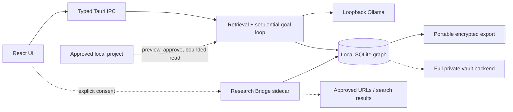

# PrismOS-AI

> **Ask your laptop, not the cloud.** A local-first desktop AI that answers over your own files and notes — running entirely on your machine, with citations and a memory that grows.

<p align="center">
  
</p>

PrismOS-AI is a Tauri desktop app that talks to a local Ollama model over a loopback-only connection. Point it at your documents, ask in plain language, and it retrieves the relevant context, answers **with source citations**, and remembers what matters in a **local knowledge graph** — no account, no cloud by default, your data stays on your laptop.

[](https://github.com/mkbhardwas12/prismos-ai/actions/workflows/ci.yml)
[](LICENSE)
[-blueviolet)](https://ollama.com)

### What it does

- 🔌 **Local & offline** — inference runs through loopback-only Ollama; after setup it works with no internet.
- 📄 **Answers over *your* files** — approval-gated indexing of your text/code/docs, with `Source:` citations you can check.
- 🧠 **A memory that grows** — a local SQLite knowledge graph accumulates context across conversations.
- 📝 **Makes real artifacts** — generates bounded DOCX / PPTX / PDF / XLSX locally, with typed validation.
- 🌐 **Web only if you ask** — an optional, consent-gated research bridge; core inference stays loopback-only.

**[→ Quick start](#quick-start)**  ·  **[Honest status of what's actually implemented](#status-at-a-glance)**  ·  MIT licensed

*A note on the pitch: this README says what PrismOS does today, plainly. No "operating system," no "patent-pending magic," no claim that eight LLMs debate — just a local RAG assistant that's careful with your data. The [status table](#status-at-a-glance) below is deliberately honest about limits.*

## Quick start

### Requirements

- Node.js and npm
- Rust toolchain
- Ollama with at least one local model
- Platform prerequisites required by Tauri 2

```bash
git clone https://github.com/mkbhardwas12/prismos-ai.git
cd prismos-ai
npm ci
ollama pull qwen3:4b
npm run tauri dev
```

Review any installer script before running it. Prebuilt packages, when published,
are available from [GitHub Releases](https://github.com/mkbhardwas12/prismos-ai/releases/latest),
but install only an independently verified package whose source revision, checksum,
publisher signature, and macOS notarization (when applicable) match the release
evidence. The current candidate workflow does not publish trusted installers, and
upgrades are manual.

### CLI

The standalone CLI talks directly to Ollama and does not run the complete GUI retrieval/workflow pipeline.

```bash
cd src-tauri
cargo build --release --bin prismos-cli
./target/release/prismos-cli ask "summarize the capability boundaries"
./target/release/prismos-cli models
./target/release/prismos-cli health
```

## Status at a glance

| Area | Current behavior |
|---|---|
| Chat and reasoning | Retrieval plus an adaptive single-pass path for ordinary chat; complex and operational requests retain the bounded `plan → build → judge → refine` loop |
| Models | Routes among models already installed in Ollama; calls are sequential, not a parallel model council |
| Project knowledge | Metadata preview, explicit approval, bounded content indexing, likely-secret redaction, source citations, atomic refresh, and source-scoped Forget |
| Private data | SQLite knowledge and audit data remain in the local app-data directory; the live database is not encrypted at rest by PrismOS |
| Portable transfer | Authenticated encrypted graph export and passphrase-encrypted cross-device sync; managed project excerpts are intentionally excluded |
| Full-database recovery tooling | Settings UI, passphrase-encrypted export, validated restore staging, and restore-before-SQLite startup swap are implemented; a real clean-profile restore drill is still required before reliance |
| Action safety | Native action policy with allow-lists, anomaly checks, process-local authenticated records, and bookkeeping checkpoints; this is not WASM or OS-level process isolation |
| Self-improvement | Synthetic smoke validation only. Personal-data harvest/full training is disabled pending dataset consent, secret/PII review, a private output destination, and a cross-process lock |
| Internet research | Optional Research Bridge with explicit per-run or standing Live knowledge consent; retrieved pages are fenced as untrusted and core inference remains loopback-only |
| Local artifact generation | Creates bounded DOCX, PPTX, PDF, and XLSX files. Model outlines use JSON mode plus typed validation; malformed or ungrounded outlines fall back to a disclosed verification-first template before any file is written |
| Updates | Manual release installation; there is no active in-app auto-updater |

For the public/private boundary, backup design, restore procedure, research provenance, and model-orchestration roadmap, read [Private Knowledge Architecture](docs/PRIVATE_KNOWLEDGE_ARCHITECTURE.md).

## Architecture


```mermaid
flowchart LR
    UI["React UI"] --> IPC["Typed Tauri IPC"]
    IPC --> WF["Retrieval + sequential goal loop"]
    WF --> OL["Loopback Ollama"]
    WF --> DB[("Local SQLite graph")]
    UI -.->|"explicit consent"| RB["Research Bridge sidecar"]
    RB -.-> WEB["Approved URLs / search results"]
    RB --> DB
    SRC["Approved local project"] -->|"preview, approve, bounded read"| WF
    DB --> PORT["Portable encrypted export"]
    DB -.-> VAULT["Full private vault backend"]
```

The workflow labels several deterministic roles—Orchestrator, Memory Keeper, Tool Smith, Sentinel, debate, and consensus—but those labels do not mean that eight independent language models are running. The actual model work is performed by configured Ollama calls. Planner, builder, and critic calls pass through the same typed inference boundary and run in order.

Some Ollama models can return a separate reasoning field. PrismOS requests it only when the installed model reports the `thinking` capability, then discards the raw trace. User-facing documents and explanations should present concise rationale, assumptions, citations, and verification—not claim to expose a model's hidden chain of thought. See [Ollama thinking](https://docs.ollama.com/capabilities/thinking).

## Current capabilities

- Fixed-loopback Ollama chat with bounded responses, capability-aware routing, and hardware-aware model-fit suggestions.
- Adaptive orchestration: ordinary chat avoids unnecessary planner/critic generations; complex, creation, and operational work keeps the quality loop.
- Hybrid SQLite/FTS retrieval with bounded graph expansion and recent conversation context.
- Approval-gated Project Knowledge for allowlisted UTF-8 text/code files, with stable source IDs and `Source: <source-id>/<relative-path>` citations.
- Bounded one-off DOCX, PPTX, and allowlisted UTF-8 text/code extraction—including CSV/TSV—with ephemeral chunking and retrieval. PDF extraction is disabled until it can be resource-isolated; convert PDFs to UTF-8 text. XLSX and legacy `.xls` fail closed before parsing; export spreadsheets as CSV/TSV.
- Local DOCX, PPTX, PDF, and XLSX generation with bounded schemas, typed pre-write validation, non-executable spreadsheet cells, session-scoped open capabilities, and a disclosed safe fallback when a local model returns malformed or ungrounded JSON. Output generation does not enable PDF/XLSX input parsing.
- Spectrum Graph memory, response feedback, cognitive-profile views, and model-performance tracking.
- Local vision when a compatible Ollama vision model is installed.
- Authenticated encrypted You-Port export/sync packages.
- Tamper-evident audit chaining for critical local operations.
- Explicit optional integrations with their own network boundaries.
- Optional Live knowledge mode that runs consented web research through the separate bridge before answering freshness-sensitive prompts.

Project knowledge is retrieved as untrusted source material, not as instructions. A scan never follows symlinks, rejects overly broad roots, skips common secret/vendor/build paths, applies size/depth/count limits, and requires a fresh approval if a candidate file changes before indexing. See [Project Knowledge](docs/PROJECT_KNOWLEDGE.md).

## Privacy and backup boundary

The concise source-behavior notice is in [PRIVACY.md](PRIVACY.md). The architecture and
recovery details below are operational guidance, not a platform certification.

This repository is public source code. Personal prompts, project excerpts, trend data, feedback, databases, audit logs, keys, model adapters, and backup packages do not belong in it. [`.gitignore`](.gitignore) blocks common private artifacts, including databases, keys, flywheel outputs, and `*.prismos-vault`, but ignore rules are only a guardrail—not encryption or access control.

| Package | Scope | Keying | Intended use |
|---|---|---|---|
| Device-bound graph export | Portable graph nodes and edges; excludes managed project excerpts | Local device secret | Same-installation backup or handoff |
| Passphrase sync package | Portable graph snapshot; excludes managed project excerpts | User passphrase | Cross-device preview and merge |
| Private vault | Complete SQLite database and optional audit log, including private project-derived data | User passphrase | Full-database replacement candidate; complete a clean-profile restore drill before relying on it |

Even encrypted backups are private. Keep the vault and passphrase in separate places. Do not commit either backup packages or secrets to this public repository. If Git is deliberately used for encrypted off-site redundancy, use a separate private repository, commit ciphertext only, and accept that Git still exposes filenames, timestamps, repository membership, and durable history. GitHub's guidance explains why removing leaked secrets or private data from history is difficult: [Removing sensitive data from a repository](https://docs.github.com/en/authentication/keeping-your-account-and-data-secure/removing-sensitive-data-from-a-repository).

## Configuration

Private inference is fixed to `http://localhost:11434`. The editable Ollama URL is used only for explicit model-management and status operations. Non-loopback management origins require both `PRISMOS_ALLOW_REMOTE_OLLAMA=1` and HTTPS; credentials, paths, queries, fragments, proxies, and redirects are rejected. Chat prompts, retrieved project context, documents, and attached images are not sent to that configurable management origin. The loopback HTTP process is not mutually authenticated by PrismOS, so OS-account and local-process integrity remain part of the trust boundary. Screen capture is unavailable in this source build; no platform artifact is security-qualified until it passes the release checklist.

Relevant settings:

| Setting | Default | Meaning |
|---|---|---|
| Ollama management URL | `http://localhost:11434` | Status plus explicit model list/pull/delete operations; private inference remains fixed loopback |
| Model | `qwen3:4b` | Default model identifier; the current Ollama tag is a thinking build, and PrismOS discards its raw reasoning trace |
| Max tokens | `2048` | Response output budget |
| Theme | `dark` | User-interface theme |

Use **Settings → Project Knowledge** to preview and approve a project. The first phase reads metadata only; file contents are read only after approval. A portable export deliberately omits the managed excerpts, so forgetting a source and restoring a portable graph cannot silently recreate them.

## Reasoning and multi-model behavior

Ordinary low-risk conversation takes a single model pass. For open-ended, complex, creation, and operational requests, PrismOS:

1. Derives bounded acceptance criteria.
2. Builds one answer candidate.
3. Applies the Sentinel gate and judges the candidate against the criteria.
4. Refines sequentially when the score improves and the iteration budget remains.
5. Returns the best accepted or best-so-far candidate with workflow metadata.

The planner or critic may route to a different installed reasoning model, but each inference is awaited before the next begins. Ollama can support concurrent requests when hardware and configuration permit, but PrismOS does not yet expose that as a parallel model council. See [Ollama FAQ](https://docs.ollama.com/faq) and [tool calling](https://docs.ollama.com/capabilities/tool-calling).

## Action-policy security model

| Control | What it does | Important limit |
|---|---|---|
| Tiered allow-list | Classifies modeled actions as safe, moderate, or restricted | Does not sandbox arbitrary third-party code |
| Anomaly checks | Flags action bursts, excessive actions, and tier escalation | Heuristic policy signal, not malware detection |
| Process-local HMAC action records | Detects modification of ephemeral policy records within the same process | Not persistent signing, an external authorization service, or hardware attestation |
| Checkpoints | Record policy state around moderate actions | Not a generic rollback of files, databases, email, or network side effects |
| Audit hash chain | Makes prior audit-line changes detectable | Does not prevent deletion or replace an external backup |
| AES-256-GCM packages | Authenticates and encrypts exported data | Live SQLite data remains plaintext at rest |
| Loopback inference policy | Fixes private chat, document, project, and image inference to the loopback Ollama origin | The loopback daemon is not mutually authenticated; model management/downloads and platform speech have separate egress boundaries |

There is no active wasmtime dependency and no claim of WASM isolation. Do not run untrusted binaries, scripts, plugins, or model tools on the assumption that PrismOS contains them.

## Self-improvement flywheel

The source tree includes an experimental flywheel, but only synthetic smoke
validation is currently permitted. It must not read personal feedback or Project
Knowledge. Full personal-data harvesting and LoRA training are disabled until the
operator can review and consent to the exact dataset, remove secrets/PII, select a
private output destination, and rely on an OS-backed cross-process lock. Smoke-model
weights or dependencies may still be downloaded when not cached.

This is not autonomous self-training. PrismOS does not train from your chats,
promote weights, or replace the default model. Ollama can import supported models
and adapters, but training requires a separately reviewed training stack; see
[Ollama import](https://docs.ollama.com/import), [Modelfile](https://docs.ollama.com/modelfile), and [Hugging Face PEFT LoRA](https://huggingface.co/docs/peft/main/conceptual_guides/lora).

## Internet research status

The optional Research Bridge is a separate egress sidecar. Manual URL research requires per-run consent; **Live knowledge** is standing consent for freshness-sensitive chat prompts and is off by default. Retrieved text is stored as untrusted research material with URL, fetch time, and content-hash receipts. Core model inference remains fixed loopback, but a research-enabled task is not an offline task.

Research retrieval does not make a source authoritative, current, complete, or licensed for reuse. Verify publication dates and important claims yourself. Robots rules matter for automated retrieval but do not grant copyright permission; see [RFC 9309](https://www.rfc-editor.org/rfc/rfc9309.html).

## Testing

```bash
npm exec tsc -- --noEmit
npm test -- --run
npm run build

cd src-tauri
cargo check --locked --lib
cargo test --locked --lib
```

CI runs on pushes and pull requests through [GitHub Actions](.github/workflows/ci.yml). Test totals change as the project evolves, so this README does not use a static passing-test count.

## Repository map

```text
src/                         React/TypeScript user interface
src-tauri/src/lib.rs         Tauri command surface and application bootstrap
src-tauri/src/agents/        Planner, builder, critic, policy, and workflow code
src-tauri/src/spectrum_graph.rs
                             SQLite graph, retrieval, migrations, and backups
src-tauri/src/project_knowledge.rs
                             Approval-gated local project ingestion
src-tauri/src/you_port.rs    Portable encrypted export and sync formats
src-tauri/src/private_vault.rs
                             Encrypted full-database recovery backend
src-tauri/src/sandbox_prism.rs
                             Native action-policy simulator and audit records
src-tauri/src/flywheel.rs    Synthetic smoke launcher; personal full mode disabled
docs/                        Design, operations, and security documentation
tools/                       Local development and verification utilities
```

## Contributing

Read [CONTRIBUTING.md](CONTRIBUTING.md), preserve the public/private boundary, and avoid capability claims that are stronger than the code. Security-relevant changes should include negative tests and explicit failure behavior.

PrismOS-AI is released under the [MIT License](LICENSE).
