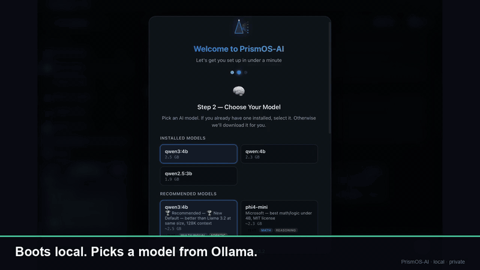
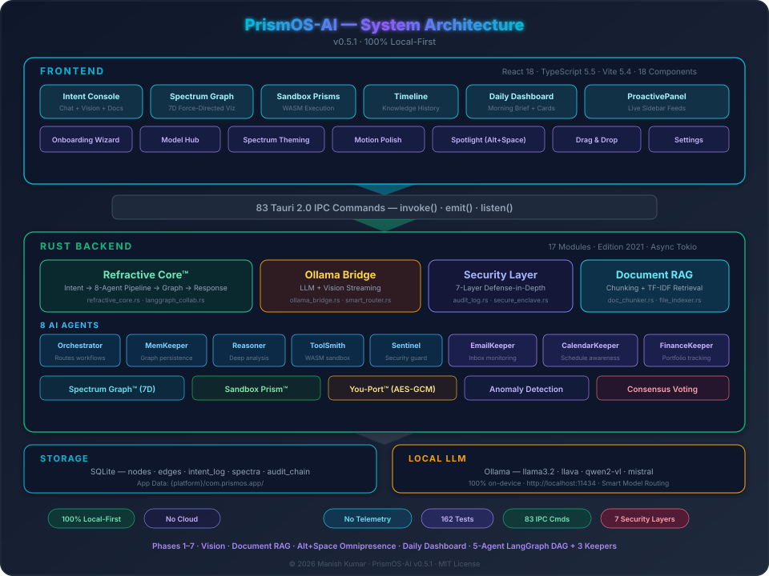

# PrismOS-AI

> **Open the lid, ask, close the lid. Your AI runs on your laptop — zero bytes leave the machine.**

Drop a PDF and ask a question. PrismOS answers from a local [Ollama](https://ollama.com) model, keeps what it learns in a knowledge graph on disk, and works with Wi-Fi off.

<p align="center">
  <a href="https://github.com/mkbhardwas12/prismos-ai/releases/latest">
    
  </a>
  <br/>
  <sub>
    <a href="docs/media/prismos-demo.mp4">▶ 1280×720 MP4 (with voiceover)</a> ·
    <a href="docs/media/stream-demo.mp4">live Ollama stream</a> ·
    <a href="docs/screenshots/">stills</a>
  </sub>
</p>

[](https://github.com/mkbhardwas12/prismos-ai/actions/workflows/ci.yml)
[](https://github.com/mkbhardwas12/prismos-ai/releases/latest)
[](LICENSE)
[-blueviolet)](https://ollama.com)

Tauri 2 + React 18 + Rust. No account, no sign-up, no remote model call.

---

## Don't take "offline" on faith — check it

The app's Content Security Policy is enforced by the OS webview, not by a
promise in a README. This is the whole allow-list, from
[`src-tauri/tauri.conf.json`](src-tauri/tauri.conf.json):

```
connect-src 'self' http://localhost:11434 http://127.0.0.1:11434
```

`localhost:11434` is your own Ollama daemon. There is no other host in the
list, so the UI cannot reach one. Verify it the hard way if you like: pull
your Ethernet, turn off Wi-Fi, and keep using the app — or point Little Snitch
/ `tcpdump` at it and watch nothing leave.

Two honest caveats, because "100% offline" gets thrown around too loosely:

- The **installer** downloads from GitHub, and **Ollama** downloads model
  weights the first time. After that, no network is required or used.
- The optional **Email Keeper** agent connects to *your* IMAP server if you
  configure it. It is off by default.
- The optional **Web Research** feature fetches web pages — but only the URLs
  you explicitly type into chat, over HTTPS, with localhost/LAN addresses
  refused. It is off by default, double-gated (a Settings toggle plus a
  Rust-side gate that hard-refuses fetches while disabled), uses no search
  engine, and sends nothing in the background. Fetches run in parallel, and
  saying *"explore"* additionally follows the most relevant links found on the
  pages you named — bounded, and every followed link passes the same gates.
  What it reads is indexed into the local knowledge graph so later answers can
  retrieve it; that indexing is local SQLite, not telemetry. The zero-network
  alternative is built in: open the page and ask PrismOS to *read your
  screen* — local vision only.

Email Keeper and Web Research are the only two features that can talk to
anything beyond localhost. Leave both off — the default — and the app has no
reason to open a socket.

---

## Try it

### Read this first if you're on macOS or Windows

**The installers are not code-signed.** I'm one person and the certificates
cost more than this project currently justifies. That means:

- **macOS** will say *"PrismOS-AI is damaged and can't be opened"* or *"Apple
  could not verify PrismOS-AI is free of malware."* The app is not damaged —
  macOS applies a quarantine flag to anything downloaded from a browser and
  refuses to run unsigned bundles. Clear it:
  ```bash
  xattr -rd com.apple.quarantine /Applications/PrismOS-AI.app
  ```
  On macOS Sequoia and later the old Control-click → Open trick no longer
  works; the `xattr` command above, or System Settings → Privacy & Security →
  *Open Anyway*, is the way through.

- **Windows** will show SmartScreen's *"Windows protected your PC."* Click
  **More info → Run anyway**.

If that trade is not one you want to make, **build from source** — the
instructions are below and the build is reproducible from a clean checkout.
Code signing is on the roadmap; until then this is the honest trade.

### Install

```bash
# macOS / Linux x64 — read the script first: scripts/install.sh
curl -fsSL https://raw.githubusercontent.com/mkbhardwas12/prismos-ai/main/scripts/install.sh | sh
```

```powershell
# Windows — per-user, no admin. Read it first: scripts/install.ps1
irm https://raw.githubusercontent.com/mkbhardwas12/prismos-ai/main/scripts/install.ps1 | iex
```

The script resolves the right asset for your architecture, **verifies its
SHA-256 against the digest GitHub publishes** and aborts on mismatch, then
bootstraps [Ollama](https://ollama.com) with `qwen3:4b` if you don't have it.

**What it costs you before the first answer:** ~15 MB app + the Ollama runtime
+ ~2.5 GB of model weights. Budget 5–15 minutes on a decent connection. You
need roughly 4 GB of free RAM to run `qwen3:4b` comfortably.

On macOS you can also install through the tap:

```bash
brew tap mkbhardwas12/prismos
brew install --cask prismos-ai   # add --no-quarantine to skip the Gatekeeper dance
```

Prefer to click? Grab an installer from the
[Releases page](https://github.com/mkbhardwas12/prismos-ai/releases/latest):

| Platform | Asset |
|---|---|
| Windows x64 | `.msi` (recommended) or `.exe` |
| macOS Apple Silicon | `PrismOS-AI_0.6.0_aarch64.dmg` |
| macOS Intel | `PrismOS-AI_0.6.0_x64.dmg` |
| Linux x64 | `.AppImage` or `.deb` |
| Linux ARM | not published — [build from source](#build-from-source) |

---

## The 60-second version: use the CLI

If you'd rather not install a desktop app to evaluate this, don't. There's a
standalone binary that talks straight to your local Ollama daemon — no GUI, no
Gatekeeper, no quarantine flag:

```bash
cargo build --release --bin prismos-cli

./target/release/prismos-cli health          # is the daemon up?
./target/release/prismos-cli models          # what's pulled locally
./target/release/prismos-cli ask "explain WASM fuel metering in one paragraph"
cat notes.md | ./target/release/prismos-cli ask --stdin --model qwen3:4b
```

`PRISMOS_MODEL` and `PRISMOS_OLLAMA_URL` override the defaults. It's pipeable,
so it composes with the rest of your shell.

Here's a real run — unedited, `qwen3:4b` (Q4_K_M, 2.5 GB) on an M5 Max, 64 GB:

```console
$ prismos-cli ask "explain WASM sandboxing in one paragraph"
WebAssembly (WASM) modules themselves do not include built-in sandboxing;
instead, **browsers enforce strict security policies that isolate WASM
execution within a secure sandbox** to prevent malicious behavior. This
sandbox restricts WASM from directly accessing the DOM, file system, network
resources, or other system-level features, enforces memory isolation via
linear memory with strict access controls (preventing memory corruption or
unauthorized reads/writes), and requires code signing to verify module
integrity before execution. By design, browsers treat WASM as a confined,
trusted environment that minimizes attack surfaces while enabling
high-performance web applications without compromising security—effectively
acting as a critical layer of defense against exploits like cross-site
scripting (XSS) or resource theft when WASM code is deployed in the browser
context.
```

8.4 s wall-clock (including the model's hidden reasoning pass), 134 tokens/s.
And an honesty note: the answer has a small-model wobble — WASM does *not*
require code signing. That's what a 2.5 GB model really sounds like; bigger
local models sharpen it, and nothing leaves the machine either way.

---

## What it actually does

| | |
|---|---|
| **Ask a local model** | Streaming chat against any Ollama model, with a curated registry of 18 models and hardware-aware recommendations on first run. |
| **Drop in documents** | PDF, DOCX, PPTX, XLSX. Text is extracted on-device, chunked, and retrieved with TF-IDF instead of naively truncated. |
| **Remember across sessions** | Answers and the concepts in them persist to a local SQLite knowledge graph you can browse, search, and view as a timeline. |
| **Route to the right model** | Attach an image and it swaps to a vision model, then swaps back. Same for code-heavy prompts. |
| **Run agents in a sandbox** | 8 agents (orchestrator, reasoner, tool smith, memory keeper, sentinel, email, calendar, finance) execute inside a wasmtime container with memory caps and CPU fuel metering. |
| **Stay reachable** | Global hotkey summons it over any app; it minimizes to the system tray and the agents stay resident. |

Full feature history — including what landed in which release — is in
[CHANGELOG.md](CHANGELOG.md).

---

## Security model

Every row links to the code, because a table of self-awarded checkmarks isn't
evidence.

| Layer | What it does | Source |
|---|---|---|
| WASM isolation | Agent actions run in wasmtime with 1–16 MB memory caps and CPU fuel metering | [`sandbox_prism.rs`](src-tauri/src/sandbox_prism.rs) |
| Action signing | HMAC-SHA256 over every action, per-sandbox salt | [`sandbox_prism.rs`](src-tauri/src/sandbox_prism.rs) |
| 3-tier allow-list | Operations classed Safe / Moderate / Restricted, per-agent permission sets | [`sandbox_prism.rs`](src-tauri/src/sandbox_prism.rs) |
| Audit chain | SHA-256 hash chain with a genesis entry over intent, export, import, sync, clear | [`audit_log.rs`](src-tauri/src/audit_log.rs) |
| Key derivation | Uses TPM 2.0 / Apple Secure Enclave **where available**, with a software fallback everywhere else — check which one you got in Settings → Security | [`secure_enclave.rs`](src-tauri/src/secure_enclave.rs) |
| Encrypted export | AES-256-GCM with device-bound keys | [`you_port.rs`](src-tauri/src/you_port.rs) |
| Network confinement | CSP locked to `self` + localhost Ollama | [`tauri.conf.json`](src-tauri/tauri.conf.json) |

**Not yet independently audited.** No third party has reviewed this. If you
work in security and want to look, open an issue — I'll take the findings.

---

## Architecture

<p align="center">
  
</p>

React frontend → Tauri IPC → Rust backend (agents, graph, sandbox) → SQLite +
local Ollama. More diagrams — data flow, security model, the intent pipeline —
in [docs/diagrams/](docs/diagrams/).

Current counts, if you're curious: 105 IPC commands, 23 Rust modules plus 5
agent sub-modules, 24 React components. Verify with
`grep -c '^#\[tauri::command\]' src-tauri/src/lib.rs`.

---

## Build from source

```bash
git clone https://github.com/mkbhardwas12/prismos-ai.git
cd prismos-ai
npm install

# Frontend only — fastest loop, no Rust toolchain needed
npm run dev

# Full desktop app — needs Rust ≥ 1.75 and your platform's Tauri prereqs
npm run tauri dev
```

Checks:

```bash
npx tsc --noEmit                  # type-check
npx vitest run                    # 176 frontend tests
cd src-tauri && cargo test        # Rust suite
```

CI runs all of these on every push and PR.

---

## Contributing

Genuinely wanted, and the bar is low — this project has had exactly one
contributor for most of its life. Good places to start are tagged
[`good first issue`](https://github.com/mkbhardwas12/prismos-ai/issues?q=is%3Aissue+is%3Aopen+label%3A%22good+first+issue%22).
Setup, code style, and the PR process are in [CONTRIBUTING.md](CONTRIBUTING.md).

The most useful thing anyone can do right now is **install it and tell me what
broke**. Reports on hardware I don't own are worth more than code.

## Extending it

A *skill* is a folder with a `SKILL.md` and a `manifest.json` that runs in the
same WASM sandbox as the built-in agents. The spec is an open v0.1 draft in
[`docs/SKILLS.md`](docs/SKILLS.md) — comments and PRs welcome before the
implementation lands.

---

## Where this actually stands

Being straight about it, because you can check most of this anyway:

- **It works.** v0.6.0 ships CI-built installers for Windows, both Macs, and
  Linux x64. 176 frontend tests and the Rust suite pass; CI is green.
- **Almost nobody uses it yet.** A few dozen installer downloads. The star and
  fork counts on this repo are not a reliable signal of anything — judge it by
  the release download counts, the issue tracker, and the commit log.
- **The auto-updater is not wired up.** The plugin is compiled in but update
  signing isn't configured, so it does nothing. Update by downloading the new
  installer.
- **Installers are unsigned.** See the macOS/Windows note above.
- **Linux ARM has no published build.** Build from source.

## Tech stack

Tauri 2.0 · React 18 · TypeScript 5.5 · Vite 5.4 · Rust 2021 · SQLite
(rusqlite) · wasmtime 27 · Ollama · AES-256-GCM · HMAC-SHA256 · GitHub Actions

## Related

[**quant-truth**](https://github.com/mkbhardwas12/quant-truth) — an open,
reproducible check of how quantization changes a local model's answers. Same
motivation: measure the thing instead of asserting it.

## License

MIT. See [LICENSE](LICENSE) and [NOTICE](NOTICE).

---

<p align="center">
  <sub>Built by <a href="https://github.com/mkbhardwas12">Manish Kumar</a> ·
  <a href="https://github.com/mkbhardwas12/prismos-ai/releases/latest">Download</a> ·
  <a href="https://github.com/mkbhardwas12/prismos-ai/issues">Issues</a> ·
  <a href="CHANGELOG.md">Changelog</a></sub>
</p>
