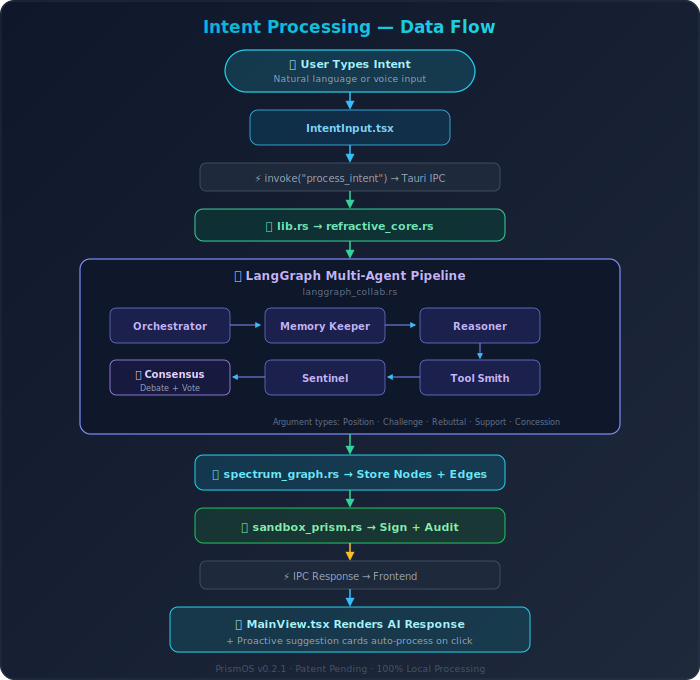

# PrismOS-AI Architecture

> Patent Pending — US Provisional Patent, Feb 2026

## Overview

PrismOS-AI is built as a **Tauri 2.0 desktop application** with a React frontend and a Rust backend. All processing happens locally — no data ever leaves the user's device.

## Layers

### 1. Frontend (React 18 + TypeScript + Vite)

The frontend provides the user interface and communicates with the Rust backend via Tauri's IPC bridge (`invoke` / `listen`).

**Key Components:**

| Component | Purpose |
|-----------|---------|
| `MainView` | Intent Console — natural language input, conversation, model management |
| `Sidebar` | Navigation, graph stats, active agent indicators |
| `SpectrumGraphView` | Force-directed 2D visualization of the knowledge graph |
| `SpectrumExplorer` | Browse, search, and manage individual nodes |
| `ActiveAgents` | Live agent activity, Sandbox Prism badges, LangGraph trace |
| `DailyBrief` | Morning Brief / Evening Recap summaries |
| `IntentInput` | Text + voice + image + document input with auto-resize |
| `SandboxPanel` | WASM sandbox inspection and rollback controls |
| `SpectralTimeline` | Time-series view of knowledge evolution |

**Shared Libraries:**

| Module | Purpose |
|--------|---------|
| `lib/config.ts` | Centralized configuration constants |
| `lib/ollama.ts` | Frontend Ollama HTTP client |
| `lib/agents.ts` | Agent definitions, system prompts, state factory |
| `hooks/useVoice.ts` | Web Speech API integration |

### 2. IPC Bridge (Tauri 2.0)

All communication between frontend and backend uses Tauri's `invoke()` for request-response and `emit()`/`listen()` for streaming events.

Key streaming events:
- `pull-progress` — Real-time model download progress (percent, MB downloaded, status)

### 3. Backend (Rust)

The Rust backend handles all data processing, storage, and AI inference.

**Core Modules:**

| Module | Lines | Purpose |
|--------|-------|---------|
| `spectrum_graph.rs` | ~2300 | SQLite-backed 7D knowledge graph engine |
| `refractive_core.rs` | ~600 | Intent → agent pipeline → graph integration |
| `sandbox_prism.rs` | ~1100 | WASM isolation + HMAC-SHA256 + auto-rollback |
| `langgraph_collab.rs` | ~500 | Multi-agent debate with consensus voting |
| `ollama_bridge.rs` | ~195 | Local Ollama HTTP client (streaming + batch) |
| `you_port.rs` | ~400 | Encrypted state export/import (AES-GCM) |
| `audit_log.rs` | ~200 | Tamper-proof SHA-256 chained audit trail |
| `model_verify.rs` | ~150 | Model integrity verification |
| `secure_enclave.rs` | ~100 | Encryption key management |

### 4. Storage

- **SQLite** — Spectrum Graph nodes, edges, intents, and metadata
- **App Data Directory** — `{platform_app_data}/com.prismos.app/`
- **No cloud storage** — Everything stays on-device

## Data Flow: Intent Processing

<p align="center">
  
</p>

## Security Architecture

See [diagrams/security-model.svg](diagrams/security-model.svg).

Every agent action passes through the Sandbox Prism:

1. **Classify** — Determine operation risk tier (1=safe, 2=moderate, 3=restricted)
2. **Sign** — HMAC-SHA256 cryptographic signature on the action
3. **Allow-list** — Verify operation is in the permitted category
4. **WASM Isolate** — Execute inside wasmtime with fuel metering + memory limits
5. **Anomaly Check** — Compare against expected patterns
6. **Auto-Rollback** — If anomalous, revert all side effects automatically
7. **Audit Log** — Append to tamper-proof SHA-256 chain

## Building

```bash
# Development
npm run tauri dev

# Production (current platform)
npm run tauri build

# Cross-platform builds are handled by GitHub Actions
# See .github/workflows/release.yml
```
