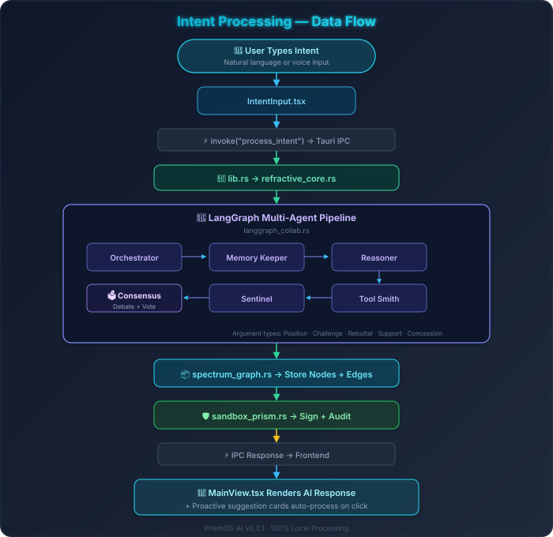

# PrismOS-AI Architecture

> Patent Pending — US Provisional Patent, Feb 2026

## Overview

PrismOS-AI is built as a **Tauri 2.0 desktop application** with a React frontend and a Rust backend. All processing happens locally — no data ever leaves the user's device.

## Layers

### 1. Frontend (React 18 + TypeScript + Vite)

The frontend provides the user interface and communicates with the Rust backend via Tauri's IPC bridge (`invoke` / `listen`).

**Key Components:**

| Component | Purpose |
|-----------|---------|
| `MainView` | Intent Console — natural language input, conversation, model management |
| `Sidebar` | Navigation (7 items), graph stats, active agent indicators, ProactivePanel |
| `DailyDashboard` | Unified morning-brief view — stats, calendar, email, finance, highlights, quick links |
| `ProactivePanel` | Permanent collapsible sidebar panel — live calendar, email, finance, graph feeds |
| `SpectrumGraphView` | Force-directed 2D visualization of the knowledge graph |
| `SpectrumExplorer` | Browse, search, and manage individual nodes |
| `ActiveAgents` | Live agent activity, Sandbox Prism badges, LangGraph trace |
| `DailyBrief` | Morning Brief / Evening Recap summaries |
| `IntentInput` | Text + voice + image + document input with auto-resize |
| `SandboxPanel` | WASM sandbox inspection and rollback controls |
| `SpectralTimeline` | Time-series view of knowledge evolution |
| `SettingsPanel` | Configuration — model, theme, startup view, export/import, sync |

**Shared Libraries:**

| Module | Purpose |
|--------|---------|
| `lib/config.ts` | Centralized configuration constants |
| `lib/ollama.ts` | Frontend Ollama HTTP client |
| `lib/agents.ts` | Agent definitions, system prompts, state factory |
| `lib/modelRegistry.ts` | Single source of truth — 15 curated AI models across 4 tiers |
| `lib/processingTimer.ts` | Response latency measurement utility |
| `hooks/useVoice.ts` | Web Speech API integration |
| `hooks/useOllama.ts` | React hook for Ollama model operations |
| `hooks/useSpectrumTheme.ts` | Dynamic Spectrum Graph theming hook |
| `hooks/useKeyboardShortcuts.ts` | Global keyboard shortcut management |

### 2. IPC Bridge (Tauri 2.0)

All communication between frontend and backend uses Tauri's `invoke()` for request-response and `emit()`/`listen()` for streaming events.

Key streaming events:
- `pull-progress` — Real-time model download progress (percent, MB downloaded, status)

### 3. Backend (Rust)

The Rust backend handles all data processing, storage, and AI inference.

**Core Modules (22 total):**

| Module | Purpose |
|--------|--------|
| `spectrum_graph.rs` | SQLite-backed 7D knowledge graph engine (14 tables) |
| `refractive_core.rs` | Intent → agent pipeline → graph integration |
| `sandbox_prism.rs` | WASM isolation + HMAC-SHA256 + auto-rollback |
| `langgraph_collab.rs` | Multi-agent debate with consensus voting |
| `ollama_bridge.rs` | Local Ollama HTTP client (streaming + batch + vision) |
| `you_port.rs` | Encrypted state export/import (AES-GCM) |
| `audit_log.rs` | Tamper-proof SHA-256 chained audit trail |
| `model_verify.rs` | Model integrity verification (SHA-256) |
| `secure_enclave.rs` | Encryption key management |
| `smart_router.rs` | Domain-aware model routing (vision + code detection) |
| `doc_chunker.rs` | Document chunking + TF-IDF RAG retrieval |
| `cognitive_drift.rs` | Self-learning: topic drift pattern detection |
| `thought_currents.rs` | Self-learning: recurring thought frequency tracking |
| `edge_prophecy.rs` | Self-learning: predicted future graph connections |
| `refraction_journal.rs` | Self-learning: AI reasoning step journal |
| `domain_detector.rs` | Auto-detect domain (code/medical/legal/finance/science) |
| `model_tracker.rs` | Per-model performance analytics + usage history |
| `voice_engine.rs` | cpal audio capture + Whisper model infrastructure |
| `file_indexer.rs` | Local RAG file watcher + auto-ingest |
| `agents/` | 5 agent sub-modules (Planner, Researcher, Coder, Reviewer, Executor) |
| `agents/langgraph_workflow.rs` | LangGraph state-machine orchestration |
| `patent_benchmarks.rs` | Performance benchmark binary |

### 4. Storage

- **SQLite** — 14 tables: nodes, edges, spectra, intents, sandbox_log, merge_history, indexed_files, model_usage, domain_cache, thought_currents, edge_prophecies, refraction_journal, cognitive_drift, audit_log
- **App Data Directory** — `{platform_app_data}/com.prismos.app/`
- **No cloud storage** — Everything stays on-device
- **478 tests** — 151 frontend (Vitest) + 327 backend (cargo test)

## Data Flow: Intent Processing

<p align="center">
  
</p>

## Security Architecture

See [diagrams/security-model.svg](diagrams/security-model.svg).

Every agent action passes through the Sandbox Prism:

1. **Classify** — Determine operation risk tier (1=safe, 2=moderate, 3=restricted)
2. **Sign** — HMAC-SHA256 cryptographic signature on the action
3. **Allow-list** — Verify operation is in the permitted category
4. **WASM Isolate** — Execute inside wasmtime with fuel metering + memory limits
5. **Anomaly Check** — Compare against expected patterns
6. **Auto-Rollback** — If anomalous, revert all side effects automatically
7. **Audit Log** — Append to tamper-proof SHA-256 chain

## IPC Surface

**85 Tauri commands** registered via `generate_handler!` macro. Key command groups:

| Group | Commands | Examples |
|-------|----------|----------|
| Graph | 15+ | `add_node`, `query_graph`, `merge_graphs`, `get_spectra` |
| Ollama | 10+ | `query_ollama`, `pull_model`, `smart_route_model`, `classify_installed_models` |
| Agents | 8+ | `run_agent`, `run_debate`, `get_agent_state` |
| Self-Learning | 12+ | `analyze_drift`, `detect_currents`, `predict_edges`, `record_refraction` |
| Domain/Model | 6+ | `detect_domain`, `record_model_usage`, `get_model_stats` |
| Security | 8+ | `run_sandbox`, `export_state`, `verify_model`, `get_audit_log` |
| Files | 5+ | `extract_file_text`, `chunk_document`, `rag_query` |
| Voice | 5+ | `start_recording`, `stop_recording`, `download_whisper_model` |

## Self-Learning Architecture

Four interconnected modules form the self-learning feedback loop:

1. **Cognitive Drift** — Detects when user interests shift over time; generates `DriftVector` with magnitude/direction/confidence
2. **Thought Currents** — Tracks recurring themes; surfaces dominant patterns with momentum scoring
3. **Edge Prophecy** — Predicts future knowledge connections using spectral similarity + temporal patterns
4. **Refraction Journal** — Records every reasoning step for transparency and introspection

All four persist to Spectrum Graph and feed back into the Refractive Core for increasingly personalized responses.

## Building

```bash
# Development
npm run tauri dev

# Production (current platform)
npm run tauri build

# Cross-platform builds are handled by GitHub Actions
# See .github/workflows/release.yml
```
