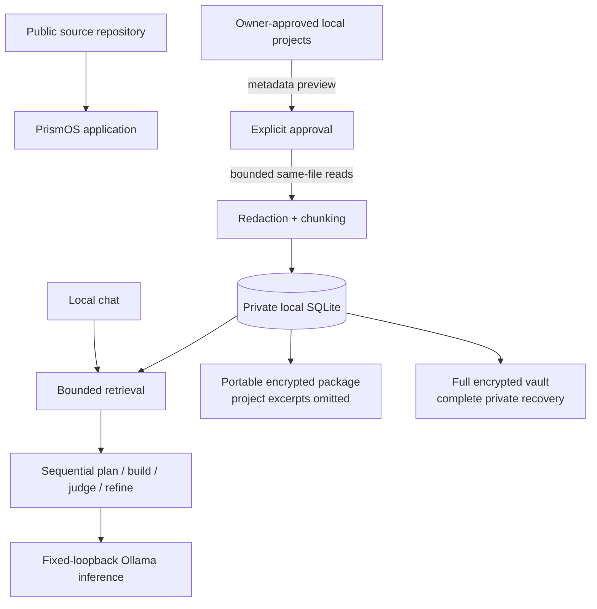
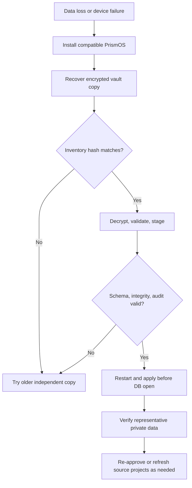

# Private Knowledge Architecture

This document defines how PrismOS can remain open source while the owner's projects, conversations, trend data, feedback, and model-training artifacts remain private and recoverable.

The central rule is simple:

> The public repository contains software. Private knowledge lives in local app data or an encrypted backup, never in the public repository.

## Implementation status

Status reflects the current repository. “Implemented” means the code path exists and is wired into the application; “backend ready” is not the same as a supported user workflow.

| Capability | Status | Boundary |
|---|---|---|
| Local Spectrum Graph | Implemented | SQLite in the per-user app-data directory; plaintext at rest |
| Approval-gated Project Knowledge | Implemented | Metadata preview before approval, bounded content reads after approval, source-scoped refresh/Forget |
| Portable device-bound graph export | Implemented | Authenticated encryption; excludes managed project excerpts |
| Passphrase cross-device graph sync | Implemented | Preview/merge workflow; excludes managed project excerpts |
| Private full-vault format | Backend and IPC implemented | Consistent full SQLite image plus optional audit log, passphrase encrypted |
| Private-vault startup restore | Implemented | Pending restore is applied before the Spectrum Graph opens |
| Private-vault Settings UI | Implemented | In-memory path/passphrase entry, passphrase confirmation, exact restore phrase, and restart guidance |
| Real restore drill | Next release gate | Must pass before the vault is treated as the only recovery copy |
| General internet research | Not implemented | No crawler or automatic web-to-knowledge ingestion |
| Sequential plan/build/judge/refine | Implemented | Bounded calls through one inference bridge |
| Parallel model council | Proposed | Must be opt-in and resource bounded |
| Flywheel training | Synthetic smoke only | Personal-data harvest/full training is disabled pending consent and security controls |

## Non-negotiable invariants

1. Public Git contains code, tests, public documentation, and non-sensitive fixtures only.
2. PrismOS never silently indexes a directory. Content ingestion requires a scoped preview and explicit approval.
3. A fresh or cleared profile stays empty; sample content never becomes owner history.
4. Retrieved text is evidence, not executable instruction.
5. Portable sharing excludes managed project excerpts and source metadata that could recreate them.
6. A full vault is encrypted before it is published and is treated as private even while encrypted.
7. A backup key or passphrase is never stored beside the backup or committed to Git.
8. Restore is an explicit replacement operation, validated and staged before the live database is touched.
9. Model reasoning is not proof. User-visible results carry rationale, assumptions, sources, and verification.
10. Training and model promotion require separate human decisions.
11. Network research, remote inference, downloads, and integrations are separate opt-in trust boundaries.

## Data classification and ownership

| Class | Examples | Normal location | Public Git? | Backup treatment |
|---|---|---|---|---|
| Public source | Rust/TypeScript, tests, public docs | Source worktree | Yes | Normal Git workflow |
| Local source corpus | Approved codebases, notes, documents | Owner-selected directories | No | Back up independently with the source's own policy |
| Indexed private knowledge | Project excerpts, source paths, conversation context, learned graph edges | `spectrum_graph.db` in app data | No | Full vault only if exact recovery is required |
| Personal signals | Feedback, cognitive profiles, trends, model performance | `spectrum_graph.db` | No | Full vault; portable package only where intentionally included |
| Audit material | Tamper-evident operation records | Local audit log | No | Optional part of full vault |
| Device secret | Key material for device-bound export | Local app data with restricted permissions | No | Do not copy to Git; use passphrase packages for cross-device recovery |
| Training material | Harvested Q&A, holdout sets, adapters, fused weights | Local flywheel directories | No | Separate encrypted model/data backup policy |
| Encrypted backup | `*.prismos-vault`, sync/export packages | Backup destination outside the source worktree | No public Git | Multiple encrypted copies; passphrase stored separately |

The local SQLite file contains private data in readable form to any process or account that can access it. PrismOS package encryption protects exported files; it does not provide full-disk or live-database encryption. Use OS account security and disk encryption as the at-rest boundary. The fixed loopback Ollama HTTP hop is also unauthenticated at the PrismOS layer, so a same-account process able to impersonate that endpoint could receive prompts.

## Runtime data flow



Project indexing applies safety limits and likely-secret redaction, but redaction is heuristic. Approval must be treated as permission to copy selected content into the local private database. It is not a guarantee that every credential or regulated datum will be detected.

## The Git boundary

The repository's [`.gitignore`](../.gitignore) blocks common private artifacts: databases and SQLite sidecars, audit logs, device keys, environment files, credentials, flywheel data and weights, portable packages, and full-vault files.

Ignore rules are a last line of defense, not the architecture. They do not:

- protect a file that was already tracked;
- remove a secret from earlier commits;
- encrypt filenames, paths, commit messages, or repository metadata;
- stop a contributor from overriding an ignore rule;
- make a public remote an acceptable backup target.

Before any public push, review the exact staged diff and tracked-file inventory:

```bash
git status --short
git diff --cached --stat
git diff --cached
git ls-files | rg '(\.db|\.sqlite|\.prismos|\.prismos-vault|\.safetensors|\.gguf)$'
```

Use `git check-ignore -v <path>` to confirm which rule protects a generated artifact. Add automated secret scanning in CI, but keep human review: detectors can miss private prose and proprietary code even when no credential pattern is present.

This repository runs `scripts/check-public-boundary.sh` in CI and candidate builds. It
rejects tracked databases, vaults, model weights, credential containers, and several
high-confidence token/key forms while printing filenames rather than secret contents.
Before committing, owners can also create the ignored local file
`.prismos-private-terms` with one proprietary name or literal per line; the same script
will fail if those terms appear in any tracked file. This owner-only list must never be
committed, and the check supplements rather than replaces review of the staged diff.

The checker inspects the exact staged index by default, supports an exact commit through
`--treeish`, and treats binary bytes as searchable so textual metadata is not skipped.
Rendered pixels still require visual review. Run `bash scripts/install-git-hooks.sh` once
per clone to activate the repository's pre-push hook; it checks every newly outgoing
commit snapshot, including a private artifact added and deleted in separate commits.
Local hooks can be bypassed with `--no-verify`, and a server-side CI failure occurs only
after a public push, so neither replaces branch protection or staged-diff review.

If private data is committed, assume it may persist in clones, forks, caches, pull-request views, and unreachable Git objects. Rotate exposed credentials first, then follow GitHub's history-removal process: [Removing sensitive data from a repository](https://docs.github.com/en/authentication/keeping-your-account-and-data-secure/removing-sensitive-data-from-a-repository).

## Backup formats are intentionally different

### Portable encrypted graph

Current You-Port graph export and passphrase sync operate on a portable graph snapshot. Managed Project Knowledge nodes and touching edges are filtered out before encryption. This design supports controlled migration without turning a convenient sync package into a duplicate of every approved source.

- Device-bound export depends on the local device secret. Losing the app data that holds that secret can make the package unusable.
- Passphrase sync is intended for cross-device preview and merge.
- Neither format is a complete disaster-recovery copy of the local database.
- Forgetting a Project Knowledge source removes its owned excerpts; a later portable import must not resurrect them.

### Full private vault

The full-vault backend captures the complete SQLite database through SQLite's online-backup API, serializes the consistent destination image, optionally includes the audit log, validates the database schema and integrity, and encrypts the payload using AES-256-GCM with a passphrase-derived key. The current format uses PBKDF2-HMAC-SHA256 with a random salt and a fixed 600,000-iteration profile.

SQLite's online-backup interface is designed to copy a live database as a consistent snapshot; see the [SQLite Online Backup API](https://www.sqlite.org/backup.html).

The backend also:

- enforces package and component size bounds;
- rejects symlinked or non-regular control paths;
- refuses to create a vault inside any Git worktree;
- refuses to overwrite an existing destination;
- authenticates ciphertext and validates internal checksums;
- performs SQLite integrity, foreign-key, schema-object, and expected-column checks before staging;
- stages plaintext restore files with restricted permissions in app data;
- applies the swap before SQLite opens on restart;
- retains protected rollback files during the startup transaction and recovers interrupted swaps when possible.

Current limitation: the backend, command surface, Settings UI, and restore-before-SQLite startup call are integrated. A real vault created during normal app use must still be restored into a clean profile and verified. Until that drill passes, keep independent backups and do not treat one vault as the only recovery copy.

## Backup operating procedure

Use a 3-2-1 pattern where practical: at least three copies, on two media types, with one copy off-site. Every copy remains encrypted.

1. Confirm PrismOS reports a healthy database and audit chain.
2. Choose a new destination outside every Git worktree. Do not overwrite the previous known-good backup.
3. Generate a unique passphrase of at least 16 characters; a longer password-manager-generated value is preferred.
4. Store the passphrase in a password manager or offline recovery record, never in the repository, shell history, backup filename, or adjacent text file.
5. Export the full vault through **Settings → Private Vault Backup & Restore**.
6. Copy the resulting ciphertext to the other backup media without changing its contents.
7. Record the PrismOS version, vault creation time, and a SHA-256 hash in a recovery inventory that contains no passphrase.
8. Perform a restore drill before deleting or rotating the prior known-good vault.
9. Retain at least two generations so silent corruption or an unwanted recent change does not replace the only usable copy.

The application must never log the passphrase or place it in an IPC error, audit detail, telemetry payload, process argument, or Git-tracked configuration.

## Restore drill

A backup is not proven until it has been restored and inspected.

1. Use a disposable test app-data directory or a separate test account. Never test by replacing the only live database.
2. Install the same PrismOS version that created the vault, or a version with an explicitly tested migration path.
3. Keep remote Ollama and optional integrations disabled during the drill.
4. Select the vault from outside a Git worktree and enter the passphrase through the application UI.
5. Type the exact destructive confirmation phrase. The backend decrypts and validates the package, then stages it without modifying the open database.
6. Restart PrismOS so the startup swap occurs before the database connection is created.
7. Verify representative conversations, graph nodes, approved-source records, learned settings, and the audit chain.
8. Confirm Project Knowledge citations resolve as expected. Restored excerpts may remain usable even if their original source directories moved, but refresh requires a new valid local source path and approval.
9. Close the test instance and securely remove the disposable plaintext app data according to the host operating system's storage guarantees.
10. Record the drill date, application version, vault hash, and outcome—never the passphrase.

Run a drill after backup-format changes, database migrations, operating-system moves, and at a regular recovery interval.

## Disaster recovery flow



Do not “repair” a rejected vault by disabling checks. Preserve the failed ciphertext, capture the exact non-secret error, and try a known-good older copy. If a restore swap fails and rollback also reports failure, stop starting the application and recover the protected rollback files before taking further action.

## Optional private Git redundancy

Git is not the preferred vault store, but it can be an additional ciphertext transport if the owner deliberately accepts its metadata and history behavior.

Use this design only:

1. Export the vault to a non-Git directory.
2. Verify the ciphertext hash.
3. Copy only the encrypted `*.prismos-vault` file into a completely separate private repository.
4. Ensure that repository has no public fork, Pages deployment, artifact publication, or broad automation access.
5. Commit no passphrase, device secret, recovery note, plaintext database, audit log, source path list, or unencrypted manifest.
6. Use an opaque filename if backup timing or project identity is sensitive.
7. Keep a non-Git backup as well; account loss, remote deletion, and repository compromise remain possible.

Never add a private remote to the public PrismOS source worktree and assume branches provide confidentiality. Repository visibility, not branch name, controls exposure.

## Research provenance architecture

### Current

PrismOS does not perform general web search, crawling, or automatic internet ingestion. Local Project Knowledge is the implemented way to add a controlled corpus.

### Proposed

A future Research Mode should be opt-in per task and keep web evidence separate from private project sources. Each retrieved item should carry:

```text
source_id
canonical_url
publisher/domain
retrieved_at
content_sha256
title and publication date when available
extraction method and bounded excerpt
license/usage note
query or task that authorized retrieval
```

The pipeline should:

1. Turn an explicit user research request into bounded queries and domain rules.
2. Show the destination/network boundary before first use.
3. Fetch through a dedicated client with time, redirect, response-size, content-type, and concurrency limits.
4. Apply SSRF protections and deny loopback, link-local, private-network, credentialed, and non-HTTP(S) destinations.
5. Treat page content as untrusted data and prevent it from changing system policy or authorizing tools.
6. Preserve citations and distinguish quotes, paraphrases, model inference, and unresolved disagreement.
7. Store provenance separately from approved local projects so retention and Forget remain source-scoped.
8. Require confirmation before promoting researched facts into durable personal memory.
9. Revalidate time-sensitive claims instead of treating old cached pages as current.

Automated retrieval should respect the Robots Exclusion Protocol in [RFC 9309](https://www.rfc-editor.org/rfc/rfc9309.html), site terms, authentication boundaries, and copyright. `robots.txt` is a crawler instruction mechanism—not a license or proof that reuse is allowed.

## Reasoning is not hidden chain-of-thought disclosure

### Current

The workflow can route eligible planning and judging calls to an installed reasoning-capable model. PrismOS requests Ollama's separate thinking output only when the fixed-loopback daemon reports that capability for the exact installed model, and it discards the raw trace. The workflow then builds, evaluates, and optionally refines a candidate within a small iteration budget. This is a real quality-control loop, but it is sequential.

### Product rule

User-visible chat and documents should expose an evidence-oriented explanation:

- concise answer or recommendation;
- decision rationale;
- source citations and provenance;
- assumptions and uncertainty;
- checks performed and checks still needed;
- alternatives and tradeoffs where material.

They should not promise a verbatim window into hidden model cognition. Raw reasoning traces can be misleading, sensitive, and unnecessarily reveal retrieved private text. A concise rationale is also easier to audit. Ollama documents which models expose a separate thinking field in [Thinking](https://docs.ollama.com/capabilities/thinking).

## Multi-model orchestration

### Current: sequential and bounded

PrismOS derives acceptance criteria, asks one builder for a candidate, runs a policy gate, asks a critic to score the candidate, and may feed bounded deficiencies into a later builder attempt. Planner and critic routing may select a different installed model, but each request is awaited in sequence. Deterministic workflow-role fan-out and vote records are not equivalent to parallel LLM inference.

### Proposed: bounded parallel council

Ollama can process concurrent requests subject to memory, queue, and server settings; see the [Ollama FAQ](https://docs.ollama.com/faq). A future council should not simply “launch every model.” It should include:

- explicit per-request opt-in;
- locally installed models only unless a separate download is approved;
- at most two candidate builders by default;
- memory/VRAM preflight and global concurrency semaphore;
- per-branch request IDs, timeout, cancellation, and output budgets;
- no network or tool side effects in candidate branches;
- one independent bounded critic or deterministic rubric;
- provenance showing which model produced and selected each candidate;
- backpressure and a fallback to the current sequential path.

Parallel tool-call syntax is a model capability, not authorization to execute tools. Tool calls still require schema validation, action policy, and side-effect controls. See [Ollama tool calling](https://docs.ollama.com/capabilities/tool-calling).

## Training and model lifecycle

### Current: synthetic smoke only

The experimental flywheel currently permits only a synthetic, non-sensitive smoke
validation of the training toolchain. It must not read personal feedback, Project
Knowledge, conversations, or a Private Vault. Personal-data harvest and full LoRA
training are disabled. Uncached smoke-model weights or dependencies may still be
fetched, creating an explicit network event.

Full training must remain disabled until PrismOS provides example-level dataset
review and separate consent, secret/PII/ownership handling, an explicit private
output destination, an immutable review manifest, and an OS-backed cross-process
lock that also covers direct script execution. Evaluation and promotion must remain
separate human decisions with a retained prior model.

Ollama's [import](https://docs.ollama.com/import) and [Modelfile](https://docs.ollama.com/modelfile) documentation cover loading supported models and adapters; they do not turn Ollama into a training system. The external training concept used here is parameter-efficient LoRA; see [Hugging Face PEFT LoRA](https://huggingface.co/docs/peft/main/conceptual_guides/lora).

### Before any autonomous scheduling

The following must exist first: dataset consent and inspection, PII/secret filtering, immutable training/evaluation manifests, process-level resource limits, reproducible environments, signed model artifacts, regression suites, rollback, and a human promotion gate. Scheduling may be automated later; authority to promote should remain explicit.

## Release gates

Do not claim full private disaster recovery until all of these pass:

- [x] Private-vault export and stage commands are registered.
- [x] Startup applies a pending restore before any SQLite connection opens.
- [x] The UI uses in-memory password inputs and does not persist the passphrase.
- [x] Restore replacement is clearly distinguished from portable merge in the UI.
- [ ] Interrupted-swap and rollback tests pass on every supported desktop platform.
- [ ] A real backup created during normal app use restores into a clean profile.
- [ ] The audit chain and representative project-derived data verify after restore.
- [ ] The public repository and build artifacts contain no private fixture data.
- [x] Documentation and UI use the same current/proposed labels.

Do not claim parallel model orchestration until concurrent independent inference calls, cancellation, capacity limits, selection provenance, and failure fallback are tested. Do not claim internet-verified answers until the provenance and network controls above are implemented.

## Primary references

- [SQLite Online Backup API](https://www.sqlite.org/backup.html)
- [GitHub: Removing sensitive data from a repository](https://docs.github.com/en/authentication/keeping-your-account-and-data-secure/removing-sensitive-data-from-a-repository)
- [Ollama: Thinking](https://docs.ollama.com/capabilities/thinking)
- [Ollama: FAQ—concurrency and memory](https://docs.ollama.com/faq)
- [Ollama: Tool calling](https://docs.ollama.com/capabilities/tool-calling)
- [Ollama: Importing models and adapters](https://docs.ollama.com/import)
- [Ollama: Modelfile reference](https://docs.ollama.com/modelfile)
- [Hugging Face PEFT: LoRA](https://huggingface.co/docs/peft/main/conceptual_guides/lora)
- [RFC 9309: Robots Exclusion Protocol](https://www.rfc-editor.org/rfc/rfc9309.html)
